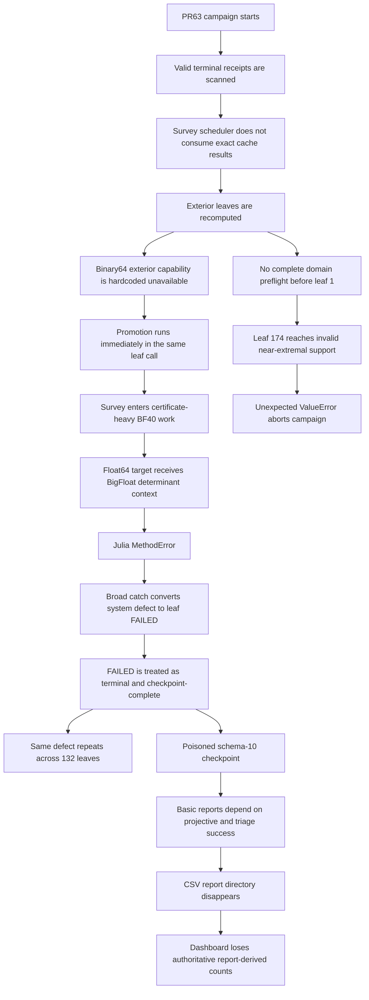

# PR #65 — Governing Completion Contract

## M02 recovery, survey separation, evidence architecture, reporting, and dashboard repair

> **Authority:** This document is the governing completion contract for PR #65. It supersedes the PR #63 implementation plan, the PR #63 repair-chain draft, and any narrower issue-specific repair instructions. A change that conflicts with this document is not an implementation choice; it is a PR #65 defect.
>
> **Product rule:** PR65 must produce a general-purpose solver. It must work on a fresh machine with zero prior receipts, on a partially completed campaign with any number of compatible receipts, and on a complete campaign. No operator-specific archive, receipt count, checkpoint hash, forensic oracle, or incident-specific leaf ID is a runtime prerequisite.
>
> **Execution rule:** The development agent may write, edit, inspect, statically validate, and run permitted software tests. It must not execute the production Kerr/GSN solver, the Julia numerical worker, the M02 PowerShell campaign, or any mathematical canary. Native PowerShell/Python/Julia acceptance is run by the operator and returned as logs.
>
> **Branch rule:** PR #65 is append-only. Do not force-push, reset the remote branch, or close/recreate the PR. If local history diverges, rebuild local work from the current remote PR65 head and replay or reconstruct intended commits so every push is a normal fast-forward.
>
> **Merge rule:** Passing hosted checks, the full permitted suite, and mandatory native canaries does not automatically remove draft status. PR #65 remains draft until the operator personally reviews the exact-head acceptance receipt and gives explicit landing approval. Only then may the protected merge path be requested. No automated agent may mark the PR ready or merge it merely because checks pass.
>
> **For `@PR Completion`:** Treat every invariant, gate, prohibition, artifact, and canary in this document as mandatory. Do not scope-reduce the repair to the currently failing mechanism, do not substitute a mocked proof for a named native boundary, do not move an unmet mandatory gate into follow-up work, do not confuse an incident-specific regression fixture with the product operating contract, and do not infer an unresolved implementation decision where this contract has closed it.

---

## 1. Objective

PR #65 must restore the objective PR #63 was supposed to implement:

> **Preserve every valid terminal result available to the operator; acquire the remaining central atlas with the minimum explicit evidence needed to screen each response; persist precision escalation as a separate queue; and reserve expensive certification and independent validation for later, separately invoked passes.**

The product must support all three starting conditions:

```text
NEW CAMPAIGN
  zero checkpoint records
  zero solved-leaf receipts
  zero root-readout receipts

RESUME
  one compatible checkpoint
  zero or more compatible cache receipts

RECOVER
  zero or more compatible historical checkpoints/stores
  produce a new validated checkpoint without numerical recomputation
```

For the current audited campaign, `examples/m02-campaign.json` is the full-role selection artifact and resolves to the 212-leaf plan. That current campaign is an acceptance target, not a product-size assumption. The same architecture must work for other valid selections and on a fresh installation.

The required computational sequence is:

```text
RECOVER OR NEW/RESUME
→ SURVEY / BINARY64
→ SURVEY / PROMOTED
→ TRIAGE
→ CERTIFY
→ VALIDATE
→ RELEASE ADMISSION
```

There is no automatic transition from one computational pass to the next.

The controlling scientific relation for an exterior survey response is:

```text
δω = −D_c / Dω
```

where the central root is already sealed, Dω is the fixed-root frequency derivative, and D_c is the fixed-root mechanism derivative. Survey obtains a bounded central response. Certification constructs the stronger local uncertainty package. Validation supplies independent publication evidence.

### 1.1 Product universality and incident-fixture boundary

This distinction is mandatory.

| Concern | Governing rule |
|---|---|
| Fresh installation | Requires no historical checkpoint, receipt archive, root-readout archive, or oracle |
| Ordinary resume | Reuses however many exact compatible records exist; the count may be 0…N |
| Generic recovery | Authenticates and preserves every valid compatible terminal record supplied; the count is discovered, not prescribed |
| PR63 forensic regression | May use a frozen incident fixture and expected-output oracle to prove recovery of that specific historical state |
| Missing incident fixture | Prevents claiming that one incident canary passed; it does not block implementation, normal operation, generic recovery, review, or any unrelated mandatory test |
| Production code | Must not contain operator-specific archive hashes, filenames, receipt counts, checkpoint hashes, or expected leaf IDs |

The mandatory generic invariant is:

```text
valid compatible terminal records supplied     N
valid compatible terminal records recovered    N
lost valid records                              0
fabricated records                              0
```

`N` may be zero.

A fresh user must be able to run:

```powershell
.\m02.ps1 -NewCampaign -Checkpoint <new-path>
```

with an empty solved-leaf store and an empty root-readout store.

A user with 7 valid receipts reuses 7. A user with 42 reuses 42. A user with 48 reuses 48. The production algorithm must never contain `expected_receipt_count == 48`.
## 2. Verified PR63 incident baseline

The following facts describe the PR63 incident and the reviewed historical recovery expectation. They are forensic evidence and regression expectations, not product prerequisites.

| Quantity | Pre-PR63 schema 9 | Post-PR63 schema 10 |
|---|---:|---:|
| Records | 41 | 173 |
| PRODUCED | 39 | 30 |
| UNRESOLVED | 1 | 0 |
| IN_PROGRESS | 1 | 0 |
| FAILED | 0 | 143 |

The active solved-leaf store contains 48 unique terminal receipts:

| Recovered terminal evidence | Count |
|---|---:|
| Total | 48 |
| PRODUCED | 45 |
| UNRESOLVED | 3 |
| FAILED | 0 |
| Horizon admittance | 28 |
| Exterior light ring | 20 |
| Duplicate leaf IDs | 0 |

Cross-mapping those receipts into the poisoned schema-10 checkpoint showed:

```text
PRODUCED → PRODUCED       28
PRODUCED → FAILED         17
UNRESOLVED → FAILED        3
```

All 20 damaged terminal receipts were exterior leaves.

Repeated production failures were:

```text
EXTERIOR_DETERMINANT_CERTIFICATE_UNAVAILABLE    132
INSUFFICIENT_ASYMPTOTIC_PRECISION                10
HORIZON_MAXIMUM_ORDER_INADEQUATE                  1
```

The terminal campaign failure occurred at leaf 174/212:

```text
ValueError: exterior profile has no smooth support outside horizon
mechanism: exterior-light-ring
root: 220 a/M=0.999998
```

### 2.1 PR63 incident regression fixture identities

| Artifact | SHA-256 |
|---|---|
| `m02-campaign-checkpoint(20260822-004719).json` | `b62f9e6c1c901cd7eee907b99d387bdc1e86be5019b5d4efd11fa28997015d35` |
| `solved-leaves-v1(3).zip` | `2d2fe86e1f2c7f5b75fbc9aa3c8b9a64cfc687f6f3640bb0ba9c571bf9b7a8a2` |
| `root-readouts-v2(2).zip` | `69aa3b2b112a7208d1444ccf564b2c0ef767d4b78e06e41f7c37b85a104b3376` |
| `m02-output(2).zip` | `8f9cb16f91ce7e59462d4f5d4ba5c672aac1689ddce30655f3b82fe9199663c3` |
| `windows_solver(1).zip` | `d2de00ff4db861022f0bd08a8032928fc703c8a551d1caf33f7187a997c98343` |
| `data.zip` | `560c65e96bb404f282ccea702a28b16500eb2f6ae4fa78e76ba70bf29bdda59a` |
| `PR65_RECOVERY_BASELINE.csv` | `7f840ead76af8c11d89f32b6e96739bde2af2846cd823ced1b7cd331226bab5c` |
| `PR65_RECOVERY_BASELINE.json` | `898b267b821cb22fc64c78211e9987dd5980bc1ff1377d45d3bed06abb2c975d` |

`PR65_RECOVERY_BASELINE.csv` is the reviewed leaf-by-leaf oracle for the **optional exact PR63 incident canary**. The recovery code must still authenticate each listed receipt and record; the CSV is not permission to bypass receipt validation.

These hashes are incident-test fixture identities only. They must not be embedded in production recovery code, required by installation or ordinary execution, used as campaign/cache identity, or treated as proof that a differently supplied archive must contain 48 receipts.

When the complete matching incident fixture and oracle are supplied, the optional incident canary expects 48/45/3/0. If the supplied material contains fewer valid receipts, generic recovery must recover the valid subset exactly, report the fixture as incomplete, fabricate nothing, and continue unrelated implementation work.

---
## 3. Verified failure chain



### 3.1 Break register

| ID | Break | Verified target | Required repair |
|---|---|---|---|
| B01 | PR63 merged before native operator gates passed | PR #63 process | PR65 remains draft until commit-bound native acceptance passes |
| B02 | Survey computes cache lookups but does not consume them | `response_batches.py` survey dispatch | Cache-first scheduler; exact terminal record reused before backend construction |
| B03 | Binary64 exterior survey is a static false capability result | `NativeCampaignStageBackend._binary64_exterior_survey_preflight()` | Delete the stub; implement a real fixed-root binary64 survey primitive |
| B04 | Promotion is immediate same-pass execution | `_run_survey_selection_active()` and `execute_profile_promoted_stage()` | Explicit binary64 and promoted survey passes with a durable queue |
| B05 | Promoted survey uses certificate-heavy determinant requests | `_run_native_exterior_survey()` and worker request policy | Add a survey-only raw fixed-root worker operation that cannot invoke certification |
| B06 | `precision_guard_context` binds source and target to the same Julia type | `m02_worker.jl` | Separate source and target type parameters; direct boundary tests |
| B07 | Broad exception containment converts infrastructure defects into leaf failures | survey-stage containment | Typed failure classifier; system defects abort immediately |
| B08 | `FAILED` is treated as scientific terminal completion | checkpoint validation and resume sets | Remove `FAILED` from numerical terminal and completion semantics |
| B09 | Existing stronger terminal evidence can be superseded | cache/recovery merge boundary | Exact terminal record immutability and monotone evidence upgrade |
| B10 | Schema transition has no mandatory verified rollback point | `m02.ps1` and checkpoint writes | New-destination recovery, verified backup, atomic cutover receipt |
| B11 | Absolute support constants fail near extremality | `response_engine.py` exterior support | Versioned gap-scaled support policy and full-plan preflight |
| B12 | Basic CSVs depend on advanced projective/triage generation | `campaign_reports.py` | Independent basic report transactions and durable report-status artifact |
| B13 | Tests validate mocks/stubs but not the production boundaries | PR63 tests | Real request-contract fixtures plus operator-run native canaries |
| B14 | Evidence metadata changes the canonical numerical record hash | PR63 record model | Separate evidence ledger; numerical records remain immutable |
| B15 | Survey has no hard work budget | survey kernel and scheduler | Enforced determinant/root/worker budgets; budget breach is a system defect |
| B16 | Main dashboard uses fragile multi-line redraw/report coupling | `progress_output.py` | Checkpoint-led clean-tail renderer with one steady live line |
| B17 | Main launcher can silently start cold when checkpoint path is absent | `m02.ps1` | Resume by default; cold start only with explicit `-NewCampaign` |
| B18 | Fixed-root timing is not durably represented by root telemetry | progress/timing path | Pass/tier timing ledger plus append-only interruption telemetry |
| B19 | Incident fixture was conflated with product recovery contract | recovery specification | Count-agnostic generic recovery; fixture-specific expectations isolated to an optional regression |

---

## 4. Non-negotiable invariants

1. **The solver works with zero prior evidence.** A fresh user can create and execute a new campaign without historical artifacts.
2. **Generic recovery is count-agnostic.** It preserves every valid compatible terminal record supplied, where the count may be zero or any positive integer.
3. **Every recovered terminal record is immutable.** Its numerical mapping, stage mappings, record hash, receipt hash, leaf ID, state, and scientific identity survive unchanged.
4. **PR63 incident counts are fixture expectations only.** No production path depends on 48 receipts or any listed archive SHA-256.
5. **The poisoned schema-10 checkpoint is forensic evidence only.** It is never resumed, migrated forward as production source, or used to overwrite a recovered record.
6. **Recovery performs no numerical work.** It must not construct a determinant backend, load a Julia adapter, launch Julia, solve an ODE, solve a root, or evaluate a determinant.
7. **Exact cache lookup precedes backend construction.** A terminal cache hit results in zero backend calls.
8. **A valid PRODUCED record never becomes UNRESOLVED, REJECTED, FAILED, or a different numerical record.**
9. **A valid UNRESOLVED record remains terminal on ordinary resume.** It runs again only through explicit requeue bound to changed scientific policy or operator selection.
10. **Binary64 survey launches no Julia process.** Not one.
11. **Promotion is never inline.** Binary64 survey records a durable queue entry and advances to the next leaf.
12. **Promoted survey is not certification.** It performs minimal fixed-root work only.
13. **Survey never invokes endpoint-pair, tight-control, cross-precision certificate, TRUNCATION root phase, RESOLUTION root phase, SEED-PATH root phase, full signed-root ladder, or independent publication validation.**
14. **BF120 is forbidden in survey.**
15. **No survey response runs a root solve after a valid root seal exists.**
16. **A system or contract defect aborts immediately.** It is never converted into a terminal numerical leaf.
17. **`FAILED` is operational, not scientific.** It is stored only in system/attempt history and never counts as campaign completion or resume-skippable numerical evidence.
18. **All selected domains and request contracts preflight before leaf 1.**
19. **Basic CSV reports survive projective and triage failure.**
20. **The checkpoint and its ledgers are authoritative.** Dashboard and CSVs are projections.
21. **The main dashboard never performs multi-line redraw.** Historical and completed rows append once; live execution occupies one bounded physical line.
22. **No execution, cache, report, dashboard, queue, or triage code is hard-coded to the current seven modes.** Synthetic 332 and 442 plans must pass non-numerical tests.
23. **Every current exterior mechanism crosses the same repaired architecture.** No light-ring-only special repair is accepted.
24. **No scientific tolerance is weakened to make a repair pass.** The established 2×10⁻¹¹ root correction threshold, branch enclosure, and derivative lower-bound logic remain unchanged unless separately reviewed scientific policy explicitly replaces them.
25. **No full campaign is used as the first integration test.** Every repaired boundary has a focused test or native canary first.
26. **Missing incident fixtures do not block implementation.** They block only the matching incident-specific canary and any exact incident-recovery claim.
27. **PR65 branch history is append-only.** No force-push, remote reset, or PR recreation is permitted. Local divergence is repaired by rebuilding from the current remote head and replaying/reconstructing commits for normal fast-forward push.
28. **Duplicate compatible evidence has deterministic precedence.** Numerical mappings remain byte-identical; compatible evidence is unioned monotonically; timestamps never decide scientific precedence.
29. **Legacy compatibility is deterministic and fail-closed.** A missing schema-11-only identity may be reconstructed only when authenticated historical data determines it uniquely.
30. **Any invalid selected support or request domain aborts preflight before leaf 1.** It is not recorded as REJECTED or DEFERRED merely to continue.
31. **The first cross-mechanism Dω reuse requires a durable `background-equivalence/v1` receipt in addition to an exact reuse-key match.**
32. **Promotion uses a closed static allowlist.** No broad typed-CONTROL fallback may request higher precision.
33. **UNRESOLVED and DEFERRED are distinct.** UNRESOLVED means survey numerics are exhausted; DEFERRED means intentionally postponed without declaring numerical exhaustion.
34. **The corrected governing dashboard contract is authoritative.** `M02-Dashboard.ps1` is a visual and ergonomic reference only, not a second authoritative renderer.
35. **Native canaries use `examples/m02-campaign.json` and bind to the exact plan emitted by the tested PR head.** The audited legacy selection ID and campaign ID authenticate recovery material but are not hard-coded production expectations.
36. **Passing all gates leaves PR65 draft.** The implementing agent presents the exact-head acceptance receipt and stops until explicit operator landing approval.
## 5. Scope

### 5.1 In scope

- Revert the PR63 execution architecture while preserving later unrelated work where possible.
- Implement count-agnostic generic recovery into a new schema-11 checkpoint.
- Recover every valid compatible terminal record available to the operator.
- Support fresh campaigns with zero historical evidence.
- Keep the PR63 48-row oracle as an optional incident regression fixture, never a production prerequisite.
- Add separate evidence, survey-pass, promotion-queue, timing, and system-failure ledgers.
- Restore cache-first scheduling.
- Implement a real binary64 fixed-root exterior survey for every selected exterior mechanism.
- Implement explicit promoted survey, certification, and validation passes.
- Add a survey-only Julia raw-sample operation.
- Repair the Julia cross-type context conversion used by certification.
- Implement the versioned near-extremal support policy.
- Preflight the complete selected plan before numerical execution.
- Decouple basic reports from projective and triage outputs.
- Replace the main Python dashboard with the clean-tail presentation model.
- Add commit-bound native PowerShell acceptance gates.
- Preserve future K2 compatibility without adding 332 or 442 to the production plan.

### 5.2 Out of scope

- Adding production K2 modes 332 or 442.
- Changing the Kerr, Teukolsky, Sasaki–Nakamura, angular, or QNM equations.
- Replacing the established determinant family or normalization.
- Weakening root, branch, derivative, or release-admission tolerances.
- Automatically certifying or validating all 212 leaves during survey.
- Using the poisoned schema-10 checkpoint as the recovered scientific source.
- Making any operator-specific fixture, receipt count, filename, or SHA-256 a product dependency.
- Running the production campaign from the development agent’s environment.

---
## 6. Schema 11: exact state architecture

PR65 must separate numerical state, evidence strength, scheduler progress, operational attempts, and system failures.

### 6.1 Envelope

```json
{
  "schema_version": 11,
  "campaign_id": "...",
  "selection_id": "...",
  "state": "PARTIAL",
  "records": [],
  "evidence_ledger": {},
  "survey_pass_ledger": {
    "binary64": {},
    "promoted": {}
  },
  "promotion_queue": {
    "schema": "windows-solver.m02-promotion-queue/1",
    "entries": []
  },
  "attempts": [],
  "system_failures": [],
  "recovery_receipts": [],
  "report_status_receipt": null
}
```

The canonical numerical record array remains independent of all changing evidence and scheduler metadata.

### 6.2 Numerical record layer

Allowed production meanings are:

```text
IN_PROGRESS      transient only; never a completed record
PRODUCED         finite retained central response and disk
UNRESOLVED       computation completed but no admissible bounded response
REJECTED         scientific/domain rejection under an explicit existing rule
```

`FAILED` is not an allowed numerical record state in schema 11.

A numerical record contains the retained centre and its numerical stages. Evidence upgrades never rewrite it.

### 6.3 Evidence ledger

Each produced leaf may have:

```json
{
  "leaf_id": "...",
  "central_record_sha256": "...",
  "central_stage_sha256": "...",
  "evidence_level": "SCREENED",
  "receipts": [],
  "discrepancy_codes": []
}
```

Monotone levels:

```text
none → SCREENED → CERTIFIED → VALIDATED
```

Definitions:

- **SCREENED:** finite central response; finite bounded local disk; authenticated root/branch identity; Dω bounded away from zero; cheap derivative refinement agrees; no unresolved survey control remains.
- **CERTIFIED:** the retained centre has the required local uncertainty evidence under the explicit certification policy, including the applicable determinant-error and derivative-authentication terms.
- **VALIDATED:** explicit independent/publication validation is present, such as the declared full signed finite-amplitude ladder or another approved independent route.

Recovery must infer evidence conservatively from actual stored stages:

```text
state == PRODUCED alone                      → not enough for CERTIFIED
bounded centre + screening predicates        → SCREENED
required local certification evidence        → CERTIFIED
explicit independent validation identity     → VALIDATED
```

A certification or validation result outside the retained central disk adds a discrepancy code and does not replace the retained centre.

### 6.4 Survey-pass ledger

Evidence level and scheduler disposition are separate.

Allowed binary64-pass dispositions:

```text
NOT_ATTEMPTED
CACHE_REUSED
COMPLETED
PROMOTION_PENDING_ROOT
PROMOTION_PENDING_RESPONSE
UNRESOLVED
DEFERRED
REJECTED
SUPERSEDED_BY_CACHE
```

Allowed promoted-pass dispositions:

```text
NOT_ATTEMPTED
CACHE_REUSED
COMPLETED
UNRESOLVED
DEFERRED
REJECTED
SUPERSEDED_BY_CACHE
```

Disposition meanings are exact:

```text
PROMOTION_PENDING_ROOT / PROMOTION_PENDING_RESPONSE
= the current pass cannot produce a bounded response and a declared later survey tier remains available

UNRESOLVED
= all arithmetic tiers and work permitted by the current survey policy have been exhausted without an admissible bounded response

DEFERRED
= execution is intentionally postponed by explicit policy, resource scheduling, or operator instruction; numerical exhaustion is not asserted

REJECTED
= a validly constructed leaf fails an explicit scientific/domain rejection rule; invalid plan construction is not converted into REJECTED
```

Examples:

```text
binary64 insufficiency with BF40 available       → PROMOTION_PENDING_*
BF40 insufficiency with BF80 allowed              → continue inside promoted pass
BF80 still cannot bound the response              → UNRESOLVED
operator/policy postpones an otherwise valid leaf → DEFERRED
```

Each pass entry binds:

```text
leaf_id
pass identity
source record hash, if any
result record hash, if any
operation identity
precision tier(s)
promotion or terminal reason code
sample count and limit
root-read count and limit
worker-launch count and limit
tier timing
session fragments
disposition receipt hash
```

### 6.5 Promotion queue

A queue entry is append-only and contains:

```text
leaf_id
queue kind: ROOT or RESPONSE
source pass: binary64
reason code
minimum requested tier
source record/stage/root-seal hashes
scientific computation identity
queue ordinal
disposition: PENDING, COMPLETED, UNRESOLVED, DEFERRED, SUPERSEDED_BY_CACHE
```

Queue entries are never deleted. They receive a terminal disposition receipt.

### 6.6 Attempts and system failures

- Typed leaf-local numerical/control outcomes are appended to `attempts`.
- Infrastructure, schema, protocol, type, and contract defects are appended to `system_failures` and abort the active pass.
- Neither collection changes the numerical record state by itself.
- Generic recovery appends a recovery receipt recording discovered candidates, accepted records, rejected/corrupt candidates, conflicts, source/output hashes, and optional incident-oracle status.
- An incident-oracle result is recovery provenance, not a production identity.

### 6.7 Completion meanings

```text
binary64 pass complete
= every selected leaf has a terminal binary64-pass disposition

promoted pass complete
= every queued promotion has a terminal promoted-pass disposition

campaign accounting complete
= every selected leaf has an explicit terminal numerical or scientific disposition

central atlas complete
= every selected leaf is PRODUCED or UNRESOLVED; any REJECTED leaf keeps the atlas scientifically incomplete until its declared treatment is resolved

release admissible
= every publication-required component satisfies the required evidence level
```

A pass can be complete while the central atlas or release package remains incomplete. These are different facts and must be reported separately.

---
## 7. Recovery pathway

### 8.1 Generic public command

Add a generic no-numerics command:

```text
solver campaign-recover SELECTION.json
    --output RECOVERED.json
    [--source-checkpoint CHECKPOINT.json]...
    [--solved-leaf-store STORE]...
    [--root-readout-store STORE]...
    [--oracle OPTIONAL-INCIDENT-ORACLE.csv]
    --receipt RECOVERY-RECEIPT.json
```

PowerShell wrapper:

```powershell
.\m02-recover.ps1 `
  -Selection .\examples\m02-campaign.json `
  -OutputCheckpoint .\m02-output\m02-campaign-checkpoint.schema11.candidate.json `
  -Receipt .\m02-output\m02-recovery-receipt.json `
  -SourceCheckpoint <optional> `
  -SolvedLeafStore <optional> `
  -RootReadoutStore <optional>
```

All source arguments are optional. Supplying no historical source is valid and creates an empty schema-11 candidate for the selected campaign.

`--oracle` is optional and fixture-specific. Production recovery logic must work without it.

### 8.2 Candidate discovery

Recovery:

1. loads the current plan and selection without constructing a numerical backend;
2. scans every supplied source for candidate terminal records;
3. authenticates each candidate independently;
4. groups candidates by exact scientific computation identity;
5. applies deterministic conflict rules;
6. writes every accepted exact terminal record to a new destination;
7. writes rejected/corrupt candidate diagnostics to the recovery receipt;
8. never modifies source artifacts.

### 8.3 Acceptance and conflict rules

For each candidate validate:

```text
outer receipt hash
record hash
stage hashes
leaf ID and role
terminal state
root/equation/branch identity
mechanism/support identity
policy identity
backend/scientific identity
selection membership
```

Rules:

```text
one valid candidate                         → accept
multiple candidates with identical numerical mappings
                                            → preserve one byte-identical canonical numerical record
                                            → union every compatible monotone evidence receipt in the separate evidence ledger
conflicting terminal centres or states      → abort recovery
corrupt alleged exact receipt               → abort recovery
off-selection compatible record             → report and ignore
```

Evidence strength is ordered:

```text
VALIDATED > CERTIFIED > SCREENED > none
```

After evidence level, prefer greater authenticated evidence completeness. Authenticated precision is only a tiebreaker when it represents genuinely stronger evidence under the same scientific computation identity. Creation or modification timestamp is never scientific precedence. If otherwise equivalent outer receipts still need deterministic ordering, use canonical receipt SHA-256 ordering.

The numerical record is never replaced merely because another wrapper is newer or carries stronger evidence. Stronger evidence is appended to the separate ledger. No heuristic chooses a different centre.

#### 8.3.1 Legacy compatibility adapter

A historical checkpoint or receipt may lack a schema-11-only identity field. Recovery must not automatically discard valid historical evidence, fabricate a value, or abort merely because a later schema added a field.

A deterministic legacy adapter may issue a `legacy-compatibility/v1` receipt only when authenticated historical content reconstructs the missing identity uniquely and the realised scientific mapping is exactly compatible.

For support identity:

```text
legacy receipt lacks support_policy_identity
→ reconstruct the legacy realised lower / upper / centre / half-width and all other scientific identities
→ compare against the current realised mapping
→ exact compatible mapping
    → issue legacy-compatibility/v1 receipt
    → reuse permitted
→ changed or non-uniquely reconstructable mapping
    → preserve as forensic input
    → treat as incompatible cache miss
```

An allegedly exact receipt that is internally corrupt still aborts. The adapter never guesses and never treats a missing field alone as proof of compatibility.

### 8.4 Generic recovery gate

For input containing `N` valid compatible unique terminal records:

```text
discovered valid unique records       N
recovered records                     N
lost valid records                    0
fabricated records                    0
record-hash changes                   0
backend constructions                 0
Julia launches                        0
determinant evaluations               0
root solves                           0
source mutations                      0
```

This is the mandatory product recovery contract.

### 8.5 Optional PR63 incident canary

When the complete reviewed PR63 fixture and oracle are supplied, additionally assert:

```text
recovered terminal records    48
PRODUCED                       45
UNRESOLVED                      3
FAILED                          0
horizon                        28
exterior light ring           20
```

When the supplied archive contains fewer oracle-listed receipts:

```text
generic recovery                    continues and recovers all valid supplied records
incident oracle status              INCOMPLETE_FIXTURE
missing oracle entries              listed explicitly
fabricated entries                  0
exact 48-record incident claim      prohibited
implementation progress             not blocked
```

The implementing agent must not request the complete archive as a prerequisite to write or test the generic recovery engine.

### 8.6 Production cutover

Cutover is a separate explicit action:

```powershell
.\m02-recover.ps1 `
  -CommitCutover `
  -CandidateCheckpoint <candidate> `
  -RecoveryReceipt <receipt> `
  -ProductionCheckpoint <production>
```

Before replacement:

```text
create timestamped byte-for-byte backup
verify source/backup size and SHA-256
validate candidate from disk
stage candidate in same directory
fsync file
atomically replace production path
preserve backup and sources permanently
write cutover receipt
```

---

### 7.7 Backup naming and cutover durability

Production cutover never uses a live checkpoint as both source and destination. The backup is permanent and never overwritten.

Recommended backup naming:

```text
m02-campaign-checkpoint.pre-pr65-recovery.YYYYMMDD-HHMMSS.json
```

The cutover receipt must bind the old production checkpoint hash, backup hash, recovered candidate hash, recovery receipt hash, exact selection/campaign identity, and atomic replacement outcome.
## 8. Public command surface

### 8.1 Production commands

Default operator invocation resumes the binary64 survey:

```powershell
.\m02.ps1
```

Equivalent explicit form:

```powershell
.\m02.ps1 -Profile survey -SurveyPass binary64
```

Promoted survey is separate:

```powershell
.\m02.ps1 -Profile survey -SurveyPass promoted
```

Certification uses the canonical unified triage queue by default:

```powershell
.\m02.ps1 -Profile certify
```

Optional queue override:

```powershell
.\m02.ps1 -Profile certify -QueuePath .\custom-certification-queue.json
```

Validation requires an explicit publication/risk selection:

```powershell
.\m02.ps1 -Profile validate -QueuePath .\publication-validation-queue.json
```

### 8.2 Fresh campaign and no implicit cold start

Normal invocation requires an existing checkpoint and resumes it. If the resolved checkpoint is absent, `m02.ps1` aborts.

Cold start is permitted only with, and requires no historical checkpoint, solved-leaf receipt archive, root-readout archive, or incident oracle:

```powershell
.\m02.ps1 -NewCampaign -Checkpoint <new-nonexistent-path>
```

`-NewCampaign` refuses an existing checkpoint. Ordinary resume never infers “start over” from a missing or mistyped path.

### 8.3 Startup disclosure

Before execution, `m02.ps1` prints:

```text
Resolved checkpoint
Selected command
Execution profile
Survey pass
Selection ID
Checkpoint schema
Recovered terminal count
Binary64 pass count
Promotion queue count
Evidence counts
Basic report directory
Status path
```

No numerical execution begins until this disclosure and full-plan preflight succeed. Startup labels the current terminal/cache counts as discovered state, never as required historical dependencies.

### 8.4 No automatic pass chaining

- Binary64 survey never starts promoted survey.
- Promoted survey never starts certification.
- Certification never starts validation.
- Validation never starts release admission.
- `campaign-validate --full` is not run after an incomplete survey pass. Pass-specific structural validation is used instead.

---
## 9. Startup and full-domain preflight

Before leaf 1, the selected plan must be completely validated.

```text
resolve runtime and package receipts
→ load selection and checkpoint
→ validate schema and campaign identity
→ authenticate cache and root-readout indices
→ materialize every selected leaf
→ compute every support mapping
→ validate every mechanism/request contract
→ verify required GSN/angular data availability
→ verify arithmetic capabilities for requested pass
→ validate queue bindings
→ generate current basic reports
→ begin numerical execution
```

Preflight must detect before leaf 1:

- invalid or non-exterior support;
- unsupported mechanism;
- unsupported mode;
- missing GSN parameter records;
- malformed root readout;
- request-schema mismatch;
- worker-operation mismatch;
- missing binary64 capability;
- missing promoted capability for queued leaves;
- stale or mismatched promotion/certification queue;
- checkpoint/selection mismatch.

A preflight defect aborts the pass without changing any leaf record.

---

If any selected leaf has invalid exterior support or an invalid request/domain contract, the entire requested pass aborts before leaf 1. The defect is a plan/preflight failure. It is not converted into a leaf-level REJECTED or DEFERRED state merely to continue. REJECTED remains reserved for a validly constructed leaf that fails an explicit scientific rejection rule.

An empty historical cache/store is valid.
## 10. Cache-first execution pathway

For every selected leaf:

```text
compute exact scientific computation identity
→ lookup solved-leaf store
→ validate receipt and record
→ exact terminal hit?
```

### Exact hit

```text
reuse the exact record mapping
→ preserve the exact record_sha256
→ preserve terminal state
→ add CACHE_REUSED pass receipt
→ zero backend construction
→ zero determinant work
→ continue
```

### Miss

```text
construct only the backend required by the requested pass
→ execute the pass-specific operation
```

### Conflict

If an allegedly exact terminal receipt is corrupt, mismatched, or conflicts with another terminal record for the same computation identity:

```text
SYSTEM_FAILURE
→ durable failure receipt
→ abort immediately
```

A weaker or newer candidate can never supersede an exact terminal record.

---

The solved-leaf/checkpoint cache may contain zero records. Empty cache state is a valid fresh-campaign condition, not an error.
## 11. Binary64 survey pathways

### 11.1 Horizon

Horizon keeps the known-good efficient production route and gains the same cache/pass separation.

```text
exact terminal cache hit
→ reuse, zero numerical work

missing horizon leaf
→ existing binary64 horizon production calculation
→ bounded central response and disk
    → numerical PRODUCED
    → evidence SCREENED
    → binary64 disposition COMPLETED
→ typed arithmetic insufficiency
    → enqueue ROOT or RESPONSE promotion
    → no inline BF80 work
```

The promoted horizon survey uses the existing BF80 analytic horizon response route. BF120 is forbidden in survey.

### 11.2 Exterior: dedicated fixed-root survey

The new exterior survey must not call `execute_stage_with_predictor()` or the historical general component engine. It uses a dedicated fixed-root primitive.

Inputs are acquired in this order:

```text
exact root-readout-store lookup
→ authenticate root receipt and branch identity
→ root seal available?
    yes → continue
    no  → record PROMOTION_PENDING_ROOT and advance; do not solve a root inline
```

The fixed-root calculation then consumes:

```text
authenticated root seal ω₀
branch identity
mechanism and support identity
binary64 numerical controls
fixed-root survey operation identity
```

Work:

```text
D₀       = D(ω₀, c=0)
Dω(h)    = [D(ω₀+h,0) − D(ω₀−h,0)] / (2h)
Dω(h/2)  = [D(ω₀+h/2,0) − D(ω₀−h/2,0)] / h
D_c(ε)   = [D(ω₀,+ε) − D(ω₀,−ε)] / (2ε)
D_c(ε/2) = [D(ω₀,+ε/2) − D(ω₀,−ε/2)] / ε
δω       = −D_c / Dω
```

The accepted derivatives use the existing centred-difference, derivative-disk, lower-bound, and quotient-disk mathematics. No determinant numerical-error certificate is fabricated. If the cheap stencil cannot bound Dω, D_c, the root correction, or the quotient, the leaf is queued for promoted survey.

### 11.2.1 Screening criteria

A binary64 exterior result becomes PRODUCED + SCREENED only if all are true:

1. exact authenticated root seal and branch identity are present;
2. D₀ and every required stencil sample are finite;
3. Dω(h) and Dω(h/2) produce a finite positive lower bound;
4. D_c(ε) and D_c(ε/2) agree within the existing screening derivative-disk rule;
5. the fixed-root correction bound is no larger than 2×10⁻¹¹;
6. the quotient centre and disk are finite;
7. the response disk is bounded and does not rely on an absent certificate term;
8. no precision, resource, domain, or control outcome remains unresolved.

Otherwise:

```text
root seal insufficient              → PROMOTION_PENDING_ROOT
fixed-root response insufficient    → PROMOTION_PENDING_RESPONSE
leaf-local terminal numerical issue → UNRESOLVED or DEFERRED
system/contract defect              → abort
```

### 11.2.2 Hard work budgets

| Work | First exact background | After exact Dω reuse |
|---|---:|---:|
| Root reads | 0 | 0 |
| D₀ samples | 1 | 0 |
| Dω samples | 4 | 0 |
| D_c samples | 4 | 4 |
| Maximum determinant samples | 9 | 4 |
| Julia launches | 0 | 0 |

A budget excess is a system contract failure. The code must not continue calculating.

---

## 12. Canonical exterior background and Dω reuse

Cross-mechanism Dω reuse is permitted only through a mechanism-independent operation:

```text
canonical-exterior-background-wronskian/v1
```

This operation:

- evaluates c = 0;
- carries no mechanism-specific support profile;
- uses one canonical unperturbed exterior propagation and match/readout convention;
- preserves the declared exterior determinant family and normalization;
- produces D₀ and Dω evidence under a dedicated computation identity.

Mechanism-specific D_c always uses the mechanism’s realised support and is never shared.

### 12.1 Exact reuse key

Dω reuse requires exact equality of:

```text
root seal SHA-256
root identity
branch identity
angular identity
background operation identity
determinant family
determinant convention
determinant normalization
readout/match convention
backend identity
numerical controls SHA-256
arithmetic tier
working precision
frequency-step policy
```

### 12.2 Equivalence gate

PR65 must prove that the zero-coupling mechanism path and canonical background path represent the same determinant under the declared normalization.

The exact reuse key is necessary but not sufficient for the first cross-mechanism reuse. Before the first reuse for each mechanism/contract version, the system must produce and authenticate a durable:

```text
background-equivalence/v1
```

receipt proving that the canonical zero-coupling background operation and the mechanism-specific c=0 route represent the same determinant under the declared family, normalization, branch, controls, and match/readout convention.

```text
first reuse for a mechanism/contract version
→ exact reuse key matches
→ valid background-equivalence/v1 receipt exists
→ reuse permitted

subsequent reuse under the exact same authenticated contract
→ exact reuse key + valid equivalence receipt
→ no repeated equivalence calculation required
```

Required tests cover every selected exterior mechanism at representative moderate and high spins. If exact equivalence is not established, cross-mechanism Dω reuse is disabled and the mechanism-local 9-sample path remains valid. The implementation must never reuse Dω merely because hashes happen to be similar.

PR65 may not claim the 4-sample target unless the equivalence gate passes and the durable receipt exists.

---
## 13. Promoted survey pathway

Promoted survey runs only through:

```powershell
.\m02.ps1 -Profile survey -SurveyPass promoted
```

It consumes only pending promotion-queue entries.

### 13.1 Horizon

```text
existing BF80 analytic horizon route
→ PRODUCED + SCREENED
or
→ UNRESOLVED / DEFERRED
```

No BF120 survey escalation.

### 13.2 Exterior response promotion

```text
reuse exact root seal
→ BF40 raw fixed-root survey batch
→ bounded response?
    yes → PRODUCED + SCREENED
    no, typed arithmetic insufficiency → BF80 raw fixed-root survey batch
    still unbounded → UNRESOLVED
```

### 13.3 Exterior root promotion

```text
one PRIMARY promoted root solve at the lowest permitted tier
→ typed arithmetic insufficiency may promote once to BF80
→ seal the accepted root
→ fixed-root raw survey batch
→ PRODUCED + SCREENED or UNRESOLVED
```

After the root seal exists, no further root call is allowed.

### 13.4 Promoted survey prohibitions

Promoted survey performs none of:

```text
BF120
TRUNCATION root phase
RESOLUTION root phase
SEED-PATH root phase
endpoint-pair certificate
tight-control determinant comparison
cross-precision determinant comparison
2h or ih publication derivative ladder
signed finite-amplitude root ladder
independent validation
```

---

## 14. Survey-only Julia operation

PR65 adds a worker operation that is structurally incapable of entering certification:

```text
operation: fixed-root-survey-batch
identity: exterior-fixed-root-survey-raw/v1
```

### 14.1 Request contract

The batch contains:

```text
schema and operation identity
leaf/job/root/branch identities
fixed central root
precision tier and working bits
canonical or mechanism-specific operation identity
ordered sample roles
maximum allowed sample count
support mapping only for D_c samples
numerical controls
resource controls
request SHA-256
```

Allowed sample roles are explicit, for example:

```text
D0
DOMEGA_REAL_PLUS_H
DOMEGA_REAL_MINUS_H
DOMEGA_REAL_PLUS_HALF_H
DOMEGA_REAL_MINUS_HALF_H
DC_PLUS_EPSILON
DC_MINUS_EPSILON
DC_PLUS_HALF_EPSILON
DC_MINUS_HALF_EPSILON
```

The worker rejects duplicate, unknown, out-of-order, or over-budget roles.

### 14.2 Worker behavior

For every sample the operation uses one selected adequate endpoint and raw determinant evaluation only.

It must not call:

```text
select_worker_outer_endpoint_pair
authenticated_determinant_progress
exterior_cross_precision_disagreement
tight_control_request
solve_phase
bounded_newton
```

Certificate-only request fields are rejected on the survey operation.

The response returns ordered raw determinant values, bounded conditioning telemetry, exact sample roles, counts, operation identity, and request binding. It does not claim the empirical publication certificate.

### 14.3 Launch budget

A promoted fixed-root survey uses at most one Julia worker request per leaf and tier. Sample batching is mandatory; nine independent worker launches are not acceptable.

---

## 15. Julia precision-boundary repair

The current signature incorrectly requires source and target contexts to use the same element type.

Required form:

```julia
function precision_guard_context(
    ::Type{T},
    evaluation_context::DeterminantRequestContext{S},
) where {T<:AbstractFloat,S<:AbstractFloat}
```

The body retains explicit conversion into T, creates a fresh conditioning accumulator and evidence store, and proves that the frozen branch cell remains identical.

Required direct specifications:

1. `DeterminantRequestContext{BigFloat}` → `DeterminantRequestContext{Float64}`.
2. BF80 ambient precision → BF40 ambient precision while retaining `BigFloat` type.
3. BF120 ambient precision → BF80 ambient precision.
4. Branch-cell change fails closed.
5. Source context is not mutated.
6. The survey-only operation never reaches this function.

Fixing this signature is necessary for certification, but it is not permission to put the certificate back into survey.

BF40→binary64 empirical certification is not a PR65 merge requirement unless a separate numerical evidence contract for that pairing is explicitly implemented and reviewed. Certification may use the existing BF80→BF40 pairing.

---

## 16. Near-extremal support policy

PR65 implements the versioned policy:

```text
adaptive-exterior-gap-standoff/v2
```

For each exterior support with centre r_c and horizon radius r₊:

```text
g = r_c − r₊
s = min(5×10⁻⁴, g/4)
w = min(w_nominal, g − s)
```

Then:

```text
lower = r_c − w
upper = r_c + w
```

Required invariants:

```text
g > 0
s > 0
w > 0
lower = centre − half_width
upper = centre + half_width
lower ≥ r₊ + s > r₊
upper < readout radius
```

### 16.1 Identity and cache compatibility

The scientific computation identity includes:

```text
support policy identity
realised lower
realised upper
realised centre
realised half-width
```

Receipt compatibility is based on the realised mapping, not merely the global algorithm version.

- If v1 and v2 produce byte-identical realised support mappings and every other scientific identity matches, the old receipt remains reusable through an explicit compatibility receipt.
- If the realised mapping changes, the computation identity changes and the old receipt is a cache miss.
- No old receipt may be reused under a changed support mapping.

### 16.2 Preflight matrix

Before leaf 1, test every selected exterior support. Automated fixtures additionally cover:

```text
a/M = 0.95
0.99
0.999
0.9999
0.99999
0.999998
0.9999999
```

Moderate-spin mappings must remain byte-identical wherever the formula leaves the nominal support unchanged. Every near-extremal mapping must remain strictly outside the horizon.

---

## 17. Triage, certification, validation, and release

### 17.1 Whole-atlas triage

After survey accounting, triage ranks:

- unresolved and deferred leaves;
- response disks containing or approaching zero;
- largest relative disks;
- binary64/promoted disagreements;
- derivative disagreements;
- branch-risk leaves;
- near-extremal supports;
- smallest projective-angle rows;
- leaves controlling projective classification;
- at least one sentinel for every mechanism and mode family.

It produces one deterministic mixed-role certification queue bound to:

```text
campaign ID
selection ID
checkpoint receipt
ordered leaf set
survey/evidence policy identity
engine identity
triage schema
```

Certification fails loudly if the canonical queue is missing, stale, or mismatched. It never silently selects all leaves.

### 17.2 Certification

Certification is explicit:

```powershell
.\m02.ps1 -Profile certify
```

It may perform:

```text
endpoint-pair comparison
tight-control comparison
cross-precision comparison
truncation and resolution checks
expanded derivative authentication
precision-ladder comparison
correlated local uncertainty construction
```

It operates around the retained central record. A centre outside the screened disk records a discrepancy and leaves the central record unchanged.

### 17.3 Validation

Validation is explicit and selection-bound:

```powershell
.\m02.ps1 -Profile validate -QueuePath <publication-selection>
```

It is reserved for:

```text
signed finite-amplitude root ladders
independent derivative routes
publication rows
disagreement cases
minimum-angle controllers
near-zero components
risk-selected sentinels
```

### 17.4 Release admission

SCREENED-only evidence is visible to the atlas and triage system but remains release-inadmissible. Publication admission requires the evidence level declared by the release manifest, with at least CERTIFIED for required components and VALIDATED where the publication policy requires it.

---

## 18. Failure semantics and circuit breaker

PR65 creates a single typed classifier in `campaign_failures.py`.

### 18.1 Promotion outcomes

Only these existing typed numerical-insufficiency codes may enqueue the next survey arithmetic tier:

```text
INSUFFICIENT_ASYMPTOTIC_PRECISION
HORIZON_ARITHMETIC_INADEQUATE
FINITE_DIFFERENCE_NOISE_LIMIT
DETERMINANT_UNCERTAINTY_TOO_LARGE
```

This set is closed. Each code must also pass its existing structured-diagnostics validation. There is no fallback from “typed CONTROL failure” to promotion. The classifier also binds whether the queue kind is ROOT or RESPONSE.

The following are explicitly not promotable merely because they are typed:

```text
ODE_RESOURCE_LIMIT
ROOT_READOUT_RESOURCE_INFEASIBLE
COORDINATE_INVERSION_STALLED
HORIZON_GEOMETRY_EXHAUSTED
HORIZON_MAXIMUM_ORDER_INADEQUATE
HORIZON_ONLY_ONE_ENDPOINT
PHYSICAL_SINGULAR_LIMIT
SCATTERING_BASIS_ILL_CONDITIONED
SCATTERING_CHART_ILL_CONDITIONED
ALGEBRAIC_REPRESENTATION_SINGULAR
branch identity failures
protocol or schema failures
unknown failure codes
```

### 18.2 Leaf-local terminal outcomes

Only allowlisted typed numerical/control outcomes with complete structured diagnostics may produce UNRESOLVED, DEFERRED, or REJECTED. Examples include the existing typed forms of:

```text
ODE_RESOURCE_LIMIT
ROOT_READOUT_RESOURCE_INFEASIBLE
COORDINATE_INVERSION_STALLED
HORIZON_GEOMETRY_EXHAUSTED
HORIZON_MAXIMUM_ORDER_INADEQUATE
HORIZON_ONLY_ONE_ENDPOINT
PHYSICAL_SINGULAR_LIMIT
SCATTERING_BASIS_ILL_CONDITIONED
SCATTERING_CHART_ILL_CONDITIONED
ALGEBRAIC_REPRESENTATION_SINGULAR
```

The mapping is a static reviewed table. Unknown codes never default to “continue.”

The outcome semantics are exact:

```text
PROMOTION_PENDING_* = a later permitted survey tier remains
UNRESOLVED          = permitted survey arithmetic/work is exhausted without a bounded response
DEFERRED            = explicitly postponed by policy/operator/resource scheduling; exhaustion is not asserted
REJECTED            = a validly constructed leaf fails an explicit scientific rejection rule
```

DEFERRED must never be used as a softer label for unresolved numerics.

### 18.3 System failures: abort on first occurrence

Any of the following is a system failure:

```text
Julia MethodError
Python TypeError
unexpected ValueError
unknown exception
malformed worker JSON
unknown response schema
missing mandatory response field
request/response identity mismatch
checkpoint digest inconsistency
record or receipt hash inconsistency
unknown failure code
worker protocol violation
sample-budget breach
root-read-budget breach
Julia-launch-budget breach
survey operation reaching certificate code
```

Action:

```text
write durable system-failure receipt
leave current leaf without a new numerical terminal record
atomically checkpoint prior committed state
abort the pass immediately
```

A typed outer wrapper does not hide an untyped inner cause. For example, `EXTERIOR_DETERMINANT_CERTIFICATE_UNAVAILABLE` with `cause_type = MethodError` is a system failure.

### 18.4 Repetition breaker

For allowlisted leaf-local outcomes, define the failure fingerprint as:

```text
failure code
failure class
stage
worker operation
request schema
backend identity
policy identity
precision tier
cause/exception type
```

The same fingerprint on two distinct leaves aborts before a third leaf starts. No identical backend defect can be written as terminal on 132 leaves again.

### 18.5 Checkpoint completion

A checkpoint containing a system failure is incomplete. Operational failure counts remain visible but never make a numerical leaf terminal or resume-skippable.

---
## 19. Reports

### 19.1 Independent basic outputs

After every committed checkpoint update, write independently and atomically:

```text
m02-leaves.csv
m02-precision-stages.csv
m02-error-channels.csv
m02-resource-failures.csv
```

These projections depend only on the validated checkpoint and basic ledgers.

`m02-leaves.csv` includes at least:

```text
numerical state
evidence level
binary64 pass disposition
promoted pass disposition
promotion reason
execution profile
survey pass
precision tier
binary64/BF40/BF80/BF120/total timing
response and disk
record/stage/receipt identities
```

### 19.2 Advanced outputs

Generate separately:

```text
m02-projective.csv
m02-triage.json
```

An advanced failure does not roll back or remove any basic output.

### 19.3 Report-status artifact

Write:

```text
m02-report-status.json
```

It records success/failure, output hash, timestamp, and error receipt for each projection independently.

Example consequence:

```text
projective reduction fails
→ leaves/precision/error/resource tables remain valid and present
→ report status marks projective FAILED
→ triage may be BLOCKED
→ dashboard displays REPORTS DEGRADED
```

### 19.4 Progress error handling

Report-generation failure is not hidden in an in-memory diagnostics list. It is persisted and visible. A basic-report failure aborts the pass after preserving the last valid checkpoint; an advanced-report failure degrades reporting but does not alter scientific state.

---

## 20. Progress and timing contracts

### 20.1 Typed progress fields

Progress records expose structured fields, not display-string inference:

```text
execution_profile
survey_pass
pass_disposition
evidence_level
promotion_reason
promotion_queue_count
sample_count_used
sample_count_limit
root_read_count
root_read_limit
worker_launch_count
worker_launch_limit
report_state
system_failure_fingerprint
binary64_seconds
bf40_seconds
bf80_seconds
bf120_seconds
total_leaf_seconds
```

Add or extend typed events for:

```text
CAMPAIGN_PASS_STARTED
CAMPAIGN_PASS_COMPLETED
LEAF_PASS_STARTED
LEAF_PASS_DISPOSITION_RECORDED
PROMOTION_QUEUED
SURVEY_SAMPLE_STARTED
SURVEY_SAMPLE_COMPLETED
SYSTEM_FAILURE_RECORDED
REPORT_STATUS_CHANGED
```

### 20.2 Timing persistence

`root-solves.jsonl` is not sufficient because a correct fixed-root survey may perform no root phase.

Timing is persisted in two places:

1. The pass ledger stores cumulative committed tier and leaf durations.
2. An append-only operational timing log stores session fragments, heartbeats, interruptions, and completions.

Required timing fields:

```text
session ID
leaf ID
profile/pass
tier
started/completed/interrupted state
elapsed tier seconds
elapsed leaf seconds
source: direct or reconstructed
```

Historical interrupted sessions are summed. Reconstructed historical values display with `~`. Timing telemetry is non-scientific and cannot modify numerical or evidence records.

---

## 21. Main Python dashboard

`progress_output.py` becomes the authoritative in-process renderer. The checkpoint and ledgers remain the authoritative state.

`M02-Dashboard.ps1` is a visual and ergonomic reference: port its clean compact aesthetic, restrained colour, historical-row presentation, tier timings, response magnitude, relative error, and clear live status wherever compatible. It is not a second authoritative renderer and must not create an independent state model. Where the PS1 and this contract differ, this contract wins: exactly one physical live line, heartbeat rewrite rather than append, checkpoint/ledger authoritative counts, no multi-line redraw or screen clearing, and no dependence on advanced reports.

### 21.1 Exact presentation model

```text
banner                         print once
campaign summary               print once
historical completed leaves    print once
new completed leaf             append once
live execution                 exactly one physical line
state change / heartbeat       rewrite that same live line
```

Historical and completed rows are append-only. The live execution line is updated with carriage return and never creates heartbeat scrollback.

Before appending a completed leaf, report failure, or system failure:

```text
erase only the current live line
→ append the durable row
→ resume one live line beneath it
```

### 21.2 Prohibited rendering

No:

```text
cursor-up escape
ESC[0J
ESC[2J
Clear-Host
multi-line redraw
terminal-height-dependent data selection
zoom-dependent row count
full arbitrary-precision decimal dumps
```

One carriage-return live line is permitted.

### 21.3 Banner

Exactly:

```text
============================================================================================================
  M02 | DASHBOARD
============================================================================================================
```

### 21.4 Static campaign content

The campaign summary displays:

```text
central responses / total
binary64 attempted
promotion queued
SCREENED
CERTIFIED
VALIDATED
UNRESOLVED
REJECTED
system FAILED
basic report state
advanced report state
```

Counts come directly from schema 11, not exclusively from CSV availability.

### 21.5 Completed-leaf table

Display every historical completion once at startup and append each new completion once.

Required columns:

```text
TIME
LEAF
MODE
SPIN
MECHANISM
PASS
EVIDENCE
PREC
f64
BF40
BF80
BF120
TOTAL
|RESPONSE|
REL.ERROR
STATE
```

Tier columns are registry-driven. Modes and mechanisms are plan-driven.

### 21.6 Live line

The single live line includes:

```text
time
campaign counts
profile/pass
current leaf/root/mechanism
tier
phase or sample role
sample used/limit
root reads used/limit
|D| or current metric
suboperation
tier elapsed / leaf elapsed
last-activity age
```

The line is clipped to the actual terminal width before writing so it cannot wrap.

### 21.7 Colour

Restrained palette:

```text
cyan       title, border, information
white      primary numerical values
yellow     phase and warning
magenta    promoted precision
blue/cyan  horizon
amber      exterior
green      produced/screened/certified/validated success
red        system failure or rejected
dark gray  metadata and reconstructed timing marker
```

Windows ANSI-disabled fallback remains readable without escape sequences.

### 21.8 Dashboard degradation

- Basic-report failure: display `BASIC REPORTS FAILED`, persist receipt, abort pass.
- Advanced-report failure: display `REPORTS DEGRADED`, keep checkpoint counts and completed rows.
- Cache publication failure: append one durable diagnostic row.
- Stale heartbeat: show in the single live line; do not append repeated warnings.

### 21.9 Required dashboard regressions

1. All historical completions print exactly once.
2. A new completion appends exactly once.
3. One hundred heartbeat updates add zero newline rows.
4. Exactly one current live line remains.
5. Completing a leaf clears only the live line, appends the row, and resumes the live line.
6. No prohibited ANSI sequence appears.
7. Schema-11 counts remain correct with projective and triage forced to fail.
8. Interrupted timing sessions sum and display `~`.
9. 108-column and compact-width snapshots pass.
10. ANSI-disabled Windows fallback passes.
11. Profile, pass, evidence level, and promotion queue are visible.
12. No mode or mechanism list is hard-coded.

`M02-Dashboard.ps1` may remain as an external diagnostic viewer, but normal production operation must not require a second window. If the external viewer retains a timing sidecar, that sidecar is explicitly presentation-only, must be stored outside the checkpoint evidence model, and must never alter numerical, evidence, pass, queue, or release state.

---
## 22. File and responsibility map

| File | Governing responsibility |
|---|---|
| `src/windows_solver/campaign_policy.py` | `ExecutionProfile`, `SurveyPass`, `SurveyDisposition`, `EvidenceLevel`, pass policies, work budgets |
| `src/windows_solver/campaign_recovery.py` | Count-agnostic no-numerics recovery, deterministic candidate precedence, legacy compatibility, schema-11 candidate, recovery receipts |
| `src/windows_solver/campaign_failures.py` | Static failure allowlist, system classification, fingerprint and circuit breaker |
| `src/windows_solver/campaign_survey.py` | Cache-first binary64/promoted schedulers, pass ledger, durable promotion queue |
| `src/windows_solver/response_batches.py` | Existing plan/record integration, schema-11 envelope validation, delegation to pass schedulers; no giant inline replacement state machine |
| `src/windows_solver/solved_leaf_cache.py` | Exact terminal receipt lookup, authentication, immutable record reuse |
| `src/windows_solver/root_readout_cache.py` | Exact root-seal lookup and authentication |
| `src/windows_solver/response_engine.py` | Fixed-root screening math, canonical exterior background operation, `background-equivalence/v1` receipts, support policy v2, quotient disk |
| `src/windows_solver/native_response_kernel.py` | Binary64 raw fixed-root determinant batch primitive and sample budgets |
| `src/windows_solver/julia_response_backend.py` | Build/parse promoted `fixed-root-survey-batch`; reject profile mismatch |
| `src/windows_solver/data/julia/m02_worker.jl` | Survey-only raw batch operation, request validation, precision-context type repair, certification path retained separately |
| `src/windows_solver/campaign_reports.py` | Independent basic projections and advanced projective projection; report-status receipt |
| `src/windows_solver/campaign_triage.py` | Deterministic whole-atlas ranking and unified mixed-role certification queue |
| `src/windows_solver/progress.py` | Typed profile/pass/sample/queue/report/system-failure events |
| `src/windows_solver/progress_output.py` | `CleanTailViewModel`, `CleanTailRenderer`, authoritative clean-tail behavior, PS1-informed visual style, one steady live line, checkpoint-led counts |
| `src/windows_solver/cli.py` | `campaign-recover`, pass-specific survey commands, explicit certify/validate queues, pass validators |
| `m02.ps1` | Safe resume-only default, explicit pass selection, no implicit cold start, main-window dashboard |
| `m02-recover.ps1` | Generic count-agnostic candidate recovery and explicit verified cutover |
| `tests/fixtures/pr65_incident/` | Optional immutable PR63 incident regression fixture and oracle; never a product prerequisite |
| `docs/engineering/pr65-native-acceptance.json` | Commit-bound native canary receipt and log hashes |

Where existing code already owns a responsibility, PR65 may preserve its location. It may not re-collapse recovery, pass scheduling, failure classification, reporting, and rendering into one giant function.

---
## 23. Ordered implementation chain

Each task is independently reviewable and must end with its hard gate passing before the next task begins.

| Order | Deliverable | Primary files | Hard gate |
|---:|---|---|---|
| 0 | Pure PR63 revert on current main | PR history and affected files | Pre-PR63 permitted suite restored; no forward repair mixed into revert commit |
| 1 | Add schema-11 contracts and separate ledgers | `campaign_policy.py`, checkpoint model | Evidence/pass changes leave `record_sha256` unchanged |
| 2 | Implement count-agnostic deterministic recovery | `campaign_recovery.py`, CLI, recovery PS1 | N valid compatible inputs → N exact outputs; deterministic evidence precedence; legacy adapter fail-closed; no backend/Julia/numerics |
| 3 | Register optional PR63 incident fixture | `tests/fixtures/pr65_incident/`, recovery manifest | Complete fixture pins 48-row oracle; incomplete/unavailable fixture is reported without blocking generic implementation |
| 4 | Restore cache-first scheduling | `solved_leaf_cache.py`, `campaign_survey.py` | Exact hit produces zero backend construction and byte-identical record |
| 5 | Add failure classifier and circuit breaker | `campaign_failures.py` | Injected MethodError aborts before next leaf; no numerical FAILED record |
| 6 | Split basic and advanced reports | `campaign_reports.py`, CLI | Basic CSVs survive forced projective and triage failures |
| 7 | Add support policy v2 and full-plan preflight | `response_engine.py`, planner/survey | Any invalid selected support aborts before leaf 1; no REJECTED/DEFERRED conversion; compatibility identities correct |
| 8 | Add binary64 raw fixed-root batch | native kernel, `response_engine.py` | ≤9 samples, zero root reads, zero Julia |
| 9 | Add canonical background Dω operation | response engine/kernel/cache | First reuse requires exact key plus authenticated `background-equivalence/v1`; otherwise reuse disabled |
| 10 | Implement binary64 survey and durable queue | `campaign_survey.py`, checkpoint/CLI | Full mocked plan launches zero Julia and performs zero inline promotions |
| 11 | Add Julia survey-only batch operation | backend and worker | Survey request cannot invoke certificate functions; one launch per leaf/tier |
| 12 | Repair Julia precision-context conversion | worker and Julia specs | Cross-type conversions and branch guard pass in operator native run |
| 13 | Implement promoted survey | survey scheduler/backend | BF40→BF80 only for the closed four-code promotion allowlist; no BF120 or certification work |
| 14 | Restore explicit certification and validation | policies, scheduler, backend | Heavy work appears only under explicit profile and never replaces centre |
| 15 | Implement whole-atlas triage | `campaign_triage.py` | Deterministic mixed-role queue bound to checkpoint and policy |
| 16 | Add typed timing/progress | `progress.py`, checkpoint timing | Fixed-root work has direct tier timing; interrupted sessions recover |
| 17 | Replace main dashboard and harden PowerShell | `progress_output.py`, `m02.ps1` | Contract-authoritative renderer; PS1 reference only; append-once rows, one live line, no implicit cold start, no redraw |
| 18 | Focused suite and draft PR | tests and PR | Focused gates pass; draft opens; no merge |
| 19 | Full permitted suite and static checks | repository | Full suite, compile/static checks, diff hygiene pass |
| 20 | Operator native canaries | PowerShell/Python/Julia on Windows | `examples/m02-campaign.json` exact-head plan bound; mandatory canaries A–G pass; PR remains draft pending operator review |

Recommended commit boundaries follow the task boundaries. No task may be hidden inside a single monolithic “PR65 fix” commit.

---

No task waits for an unavailable incident ZIP unless that task is specifically the optional incident-fixture canary.
## 24. Automated test matrix

### 24.1 Recovery and schema

- Recovery with zero historical sources → valid empty schema-11 candidate.
- Recovery with 1, 7, 42, and arbitrary N valid receipts → N exact records.
- No hard-coded 48 count, incident filename, or fixture SHA in production modules.
- Optional complete PR63 fixture → exact 48-row oracle recovery.
- Optional oracle with missing archive entries → `INCOMPLETE_FIXTURE`, no fabrication, generic recovery continues.
- Record mappings and hashes unchanged.
- Evidence upgrade does not alter numerical record hash.
- Poisoned schema-10 source rejected.
- Recovery destination-existing refusal.
- Backup byte length and SHA verification.
- Conflicting terminal receipt abort.
- Recovery imports no numerical backend module that constructs a worker.

### 24.2 Cache and resume

- PRODUCED cache hit: zero backend calls.
- UNRESOLVED cache hit: zero backend calls and ordinary resume skip.
- Exact receipt corruption aborts.
- Weaker candidate cannot replace terminal record.
- Changed realised support correctly causes cache miss.
- Compatible unchanged realised support correctly reuses through compatibility receipt.

### 24.3 Binary64 survey

- Every selected exterior mechanism uses the same fixed-root interface.
- First background uses no more than 9 samples.
- Exact Dω reuse uses no more than 4 mechanism samples.
- Root reads equal zero.
- Julia constructions and launches equal zero.
- No `run_component()` or signed-root ladder call.
- Bounded result creates PRODUCED + SCREENED.
- Typed insufficiency creates queue entry and advances.
- No inline promoted call.

### 24.4 Promoted survey and worker

- Survey batch rejects certificate-only fields.
- Survey batch cannot call certificate functions.
- Ordered sample roles and count enforced.
- BF40 first.
- BF80 only on typed arithmetic insufficiency.
- BF120 rejected.
- Root promotion limited to one PRIMARY solve per tier.
- No diagnostic root phase.
- One worker request per leaf/tier.

### 24.5 Certification and validation

- Certification requires SCREENED.
- Validation requires CERTIFIED.
- Certification may use certificate path; survey may not.
- Centre disagreement records discrepancy and does not replace centre.
- Stronger evidence is monotone.
- SCREENED-only release reduction rejected.

### 24.6 Failure handling

- MethodError, TypeError, unexpected ValueError, malformed JSON, unknown code, digest mismatch all abort immediately.
- Wrapped untyped cause remains system failure.
- Typed leaf-local outcome continues once.
- Same fingerprint on two leaves aborts before third.
- Checkpoint with system failure is incomplete.
- No system failure creates a numerical FAILED record.

### 24.7 Support and K2 compatibility

- Full selected-plan support preflight before numerical execution.
- Support policy v2 matrix through a/M=0.9999999.
- Moderate-spin unchanged mapping checks.
- Synthetic plans containing 332 and 442 pass planning, schema, cache, queue, reports, triage, progress, and dashboard tests.
- No current-mode table is consulted.

### 24.8 Reports and dashboard

- Basic tables persist under forced projective failure.
- Basic tables persist under forced triage failure.
- Report-status JSON records each projection.
- Every historical row prints once.
- Every new completion appends once.
- One hundred heartbeats add zero newline rows.
- One bounded live line remains.
- No cursor-up/erase/clear sequences.
- Counts remain correct without advanced reports.
- Timing sessions sum and reconstructed values carry `~`.
- Windows no-ANSI fallback and width snapshots pass.

---

### 24.9 Governing decision closure

- Duplicate identical numerical candidates preserve one canonical record and union compatible evidence by `VALIDATED > CERTIFIED > SCREENED > none`; timestamps never decide scientific precedence.
- Legacy missing schema-11 identity reconstructs only through deterministic `legacy-compatibility/v1`; ambiguous reconstruction becomes an incompatible cache miss.
- One invalid selected support aborts preflight before leaf 1 and creates no REJECTED or DEFERRED numerical record.
- First cross-mechanism Dω reuse requires both exact key and valid `background-equivalence/v1`.
- Promotion accepts exactly the four closed allowlist codes and rejects broad typed-CONTROL promotion.
- UNRESOLVED, DEFERRED, and PROMOTION_PENDING transition tests enforce their exact meanings.
- Dashboard contract overrides PS1 behavior where they differ and only one authoritative in-process renderer exists.
- Mandatory native canaries bind to `examples/m02-campaign.json`, 212 leaves, Primary 140 / Control 24 / Deep 48, and exact-head emitted IDs.
- Simulated local-history divergence permits only replay/reconstruction onto remote head and normal fast-forward.
## 25. Operator-run native canaries

All mandatory canaries bind the exact PR head SHA, runtime receipt, script hashes, selection artifact hash, exact-head campaign/selection IDs, output hashes, exit codes, and log hashes in `docs/engineering/pr65-native-acceptance.json`.

If the PR head changes after a canary, affected canaries must be rerun.

### 25.1 Canonical canary selection and exact-head plan binding

The mandatory native canaries use:

```text
repository path: examples/m02-campaign.json
role: all
leaf_ids: null
cohort_ids: null
current audited legacy selection ID: campaign-selection-36872f8039df4fa7fa1986fa777624b6b9645f657acf87914e4058ffce925b9b
current audited legacy campaign ID: b-prime-campaign-ff79db99415efc7613df238129c2ad261380147d24723ea927f13ef749afd2d4
legacy audited leaf count: 212
legacy audited role counts: Primary 140, Control 24, Deep 48
```

The legacy IDs authenticate schema-9 and incident-recovery material. They are not hard-coded schema-11 production expectations. Because PR65 changes scientific identities, the exact-head `campaign-plan` may legitimately emit new campaign and selection IDs.

Every mandatory canary must assert and record:

```text
artifact = examples/m02-campaign.json
role = all
leaf count = 212
Primary = 140
Control = 24
Deep = 48
campaign/selection IDs = exact values emitted by campaign-plan from the tested PR65 head
```

### Canary A — fresh-machine path

On a clean copied workspace with empty stores:

```text
-NewCampaign creates schema 11
zero historical artifacts required
full plan preflights
binary64 survey can start
```

This canary proves the product does not depend on PR63 recovery material.

### Canary B — generic partial recovery

Use the actual supplied partial fixture containing N valid records.

Expected:

```text
N recovered exactly
0 lost
0 fabricated
0 numerical worker launches
0 determinant evaluations
0 root solves
basic reports present
source hashes unchanged
```

### Canary C — cache-first plus binary64 all-mechanism path

Use a copied checkpoint and a small selection containing:

- at least one cached horizon leaf;
- at least one cached exterior leaf;
- one genuinely uncached easy leaf for every selected exterior mechanism.

Prove:

```text
cached records byte-identical
zero backend calls on cache hits
uncached exterior leaves use binary64 fixed-root batch
zero Julia launches
sample budgets respected
first cross-mechanism Dω reuse has background-equivalence/v1
promotion recorded but not executed inline
```

### Canary D — promoted response

One queued exterior response leaf:

```text
explicit promoted survey command
→ BF40 raw survey batch
→ BF80 only if one of the closed four promotion codes applies
→ no certificate, no diagnostic phases, no BF120
→ queue disposition committed
```

### Canary E — certification

One screened sentinel:

```text
explicit certify command
→ certification-only heavy evidence appears
→ fixed Julia cross-tier boundary succeeds
→ central record hash unchanged
→ evidence strengthens or discrepancy is recorded
```

### Canary F — system-failure injection

Inject a deterministic nested `MethodError` or malformed worker response:

```text
system-failure receipt written
current leaf receives no terminal numerical record
pass aborts immediately
next leaf never starts
```

### Canary G — dashboard and reports

Run the normal main-window renderer against copied live progress:

```text
all historical rows once
one bounded live line
100 heartbeats add zero newline rows
new completion appends once
advanced report failure displays REPORTS DEGRADED
basic CSVs remain present
PS1 visual conventions are used only where compatible with governing renderer behavior
```

### Optional Canary H — exact PR63 incident fixture

Run only if the complete matching fixture is available.

Expected:

```text
48 total
45 PRODUCED
3 UNRESOLVED
0 FAILED
28 horizon
20 exterior light ring
```

If unavailable or incomplete, record `NOT_RUN_FIXTURE_UNAVAILABLE` or `INCOMPLETE_FIXTURE`; list missing oracle entries; fabricate nothing; do not block generic implementation or mandatory canaries.
## 26. PR workflow and merge gates

### 26.1 Append-only branch history

PR65 keeps its existing remote branch and PR identity. Do not force-push, reset the remote branch, or close/recreate the PR.

If local history cannot fast-forward the remote PR65 branch:

```text
fetch current remote PR65 head
→ rebuild the local working branch from that head
→ replay or cherry-pick intended local commits
→ reconstruct any commit that cannot be replayed cleanly as a new commit on top
→ push by normal fast-forward only
```

No force-push and no remote reset.

### 26.2 Gates and landing authority

1. Preserve existing append-only governing-document commits. The first implementation commit after them is a pure revert of PR63 merge commit `a896850bb067d2347445b55d4b1f4220f9ce12d1`, with no forward repair mixed into it.
2. Confirm the pre-PR63 permitted suite baseline.
3. Implement tasks in the stated order with reviewable commits.
4. Keep PR65 draft after focused generic recovery, schema, cache, failure, and orchestration tests pass.
5. Run the full permitted Python/software suite while the draft is live.
6. Do not execute the production campaign from the development environment.
7. Operator runs mandatory Canaries A–G against the exact PR head and exact-head plan binding.
8. Record the commit-bound acceptance receipt with runtime, plan, log, and artifact hashes.
9. Optional exact PR63 Canary H is supplementary unless the complete fixture is supplied; its absence cannot block generic product completion.
10. Hosted checks, full permitted suite, static checks, and mandatory Canaries A–G must all pass.
11. Passing those gates does **not** mark the PR ready. PR65 remains draft while the implementing agent presents the completed acceptance receipt and stops.
12. The operator personally reviews the receipt and gives explicit landing approval in conversation.
13. Only after that approval may the protected merge path be requested and the PR leave draft.
14. No autonomous merge, no automatic ready-for-review transition, and no inferred approval.

### 26.3 Required PR evidence

The PR summary must list:

```text
PR head SHA
remote PR65 branch head before native execution
examples/m02-campaign.json blob SHA
exact-head campaign ID and selection ID
leaf count and Primary/Control/Deep counts
generic recovery N/N counts and recovery receipt hashes
schema-11 candidate/checkpoint hashes
basic report hashes
focused test command/results
full suite command/results
static worker/request checks
native canary commands A–G
native log hashes and outcomes
background-equivalence/v1 receipt hashes used by Dω reuse
incident fixture status: PASS, INCOMPLETE, or NOT_SUPPLIED
remaining known limitations, if any
operator timestamp
landing approval status: PENDING until explicit operator review
```

A claim not backed by a test, artifact, or operator log must be labelled unverified.
## 27. Prohibitions

PR65 must not:


- force-push, reset the remote PR65 branch, or close/recreate the PR to resolve history divergence;
- require any operator-specific archive to build or run the solver;
- embed the 48 count or incident SHA values in production modules;
- stop generic implementation because an incident fixture is incomplete;
- fabricate missing incident receipts;
- claim exact 48 recovery without the complete matching fixture;
- choose duplicate scientific evidence by newest timestamp;
- guess a missing legacy identity or treat a missing schema-11-only field as automatic compatibility;
- convert invalid full-plan support into REJECTED or DEFERRED merely to keep running;
- claim Dω reuse from an exact key alone; first reuse also requires `background-equivalence/v1`;
- promote any typed CONTROL failure outside the closed four-code allowlist;
- use DEFERRED as a synonym for exhausted numerics;
- maintain the PS1 and Python dashboards as separate authoritative implementations;
- hard-code the audited legacy selection ID as the expected PR65 schema-11 selection ID;
- mark PR65 ready, request merge, or merge merely because mandatory native evidence passes; explicit operator review and landing approval are still required;

- patch forward on the poisoned schema-10 checkpoint;
- overwrite the schema-9 source;
- delete or invalidate solved-leaf or root-readout stores;
- use `execute_stage_with_predictor()` as the new fixed-root survey;
- keep the hardcoded binary64-unavailable stub;
- run promoted work inline during binary64 survey;
- fix only the Julia signature while retaining the certificate-heavy survey route;
- call the empirical exterior certificate from survey;
- let `FAILED` count as numerical completion;
- contain unknown infrastructure errors per leaf;
- retry the same system defect across the campaign;
- silently regenerate or replace a stale certification queue;
- change a retained central record during certification or validation;
- reuse a receipt under a changed realised support mapping;
- claim cross-mechanism Dω reuse without the canonical-operation equivalence gate;
- couple basic CSV output to projective or triage success;
- infer dashboard counts solely from optional reports;
- use multi-line cursor redraw or heartbeat append growth;
- hard-code current modes or repair only light ring;
- add production K2 modes in this PR;
- weaken scientific tolerances;
- use a full production campaign as the first boundary test;
- merge before native operator evidence passes.

---
## 28. Definition of done

### 28.1 Product implementation completion

```text
PR63 execution architecture reverted                  PASS
Schema-11 separate ledgers                            PASS
fresh campaign with zero prior receipts               PASS
generic recovery with arbitrary N                     N/N
valid recovered records lost                          0
fabricated records                                    0
recovered numerical record changes                    0
cache-hit backend calls                               0
binary64 exterior Julia launches                      0
inline promotions                                     0
survey empirical certificates                         0
survey diagnostic root ladders                        0
first-background determinant samples                ≤ 9
exact-Dω-reuse mechanism samples                    ≤ 4
first-use Dω equivalence receipts                     present where reuse occurs
closed promotion allowlist                            exact four codes
legacy compatibility adapter                          deterministic / fail-closed
duplicate evidence precedence                         monotone / timestamp-independent
invalid support preflight                             aborts before leaf 1
repeated systemic failures                            0
basic report files after each checkpoint commit       present
dashboard multi-line redraw operations                0
heartbeat newline growth                              0
promotion queue                                       explicit and durable
certification queue                                   unified and mixed-role
validation                                            explicit only
SCREENED-only release admission                       rejected
synthetic 332/442 pipeline                            accepted non-numerically
focused tests                                         PASS
full permitted suite                                  PASS
mandatory native canaries A–G                         PASS
canonical canary artifact                             examples/m02-campaign.json
exact-head plan counts                                212 / 140 / 24 / 48
PR65 branch history                                   append-only / fast-forward
PR exact-head acceptance receipt                      present
landing approval                                      PENDING until operator review
```

### 28.2 Optional PR63 incident recovery status

```text
complete matching fixture supplied?
  yes → optional Canary H must report 48/45/3/0 before claiming exact PR63 restoration
  no  → recover every valid supplied record, report N/N, list missing oracle items, make no exact-48 claim
```

The complete incident fixture is not a product prerequisite and its absence does not make the mandatory generic recovery contract fail.

### 28.3 Operational recovery completion

```text
production checkpoint backup verified
schema-11 candidate validated
atomic cutover receipt written
standard checkpoint path contains recovered schema 11
all valid supplied terminal records visible in basic CSVs and dashboard
ordinary resume begins at the first genuinely missing binary64-survey disposition
```

### 28.4 What PR65 does not need to claim before merge

PR65 does not need to finish the entire 212-leaf production campaign before merge. It must prove through generic recovery, focused tests, and mandatory native canaries that the repaired execution architecture is safe to operate. The full binary64 survey begins only after PR65 is accepted.
## 29. Required completion statement

The implementing agent must not close with a generic success claim.

Development handoff:

```text
Code written.
No production solver or mathematical campaign was executed by the development agent.
Focused and full permitted software checks: [exact results].
Generic recovery tests: [N cases and outcomes].
Incident fixture status: [PASS 48/45/3/0 | INCOMPLETE | NOT SUPPLIED].
PR65 remains draft.
Awaiting mandatory native PowerShell canary logs A–G against commit [SHA].
```

After A–G pass:

```text
Mandatory native canaries A–G: PASS.
Exact-head acceptance receipt: [path/hash].
PR65 remains draft.
Landing approval: PENDING OPERATOR REVIEW.
No ready-for-review transition or merge action has been taken.
```

No agent may ask for the exact PR63 archive as a prerequisite to continue generic implementation. It may request it only when ready to run optional exact incident Canary H, and must describe that scope accurately.

No missing mandatory gate may be described as “expected to pass.”
## 30. Governing rule

> **Build a general solver that works from zero prior evidence, any compatible partial state, or a complete campaign; preserve every valid result supplied; acquire the remaining atlas with the minimum explicit evidence needed to screen each response; spend extreme computation only in later explicit passes; and never let a newer policy, renderer, report failure, backend defect, or missing forensic fixture erase or block sound scientific work.**
