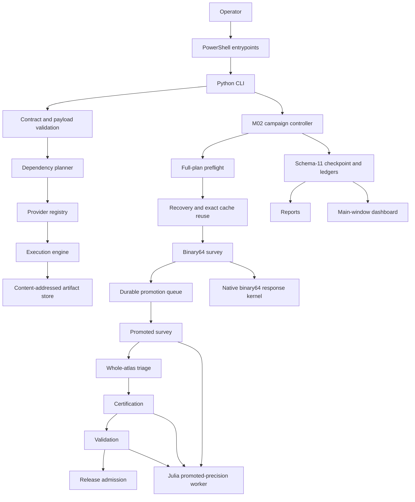

# Architecture

## Current technical architecture of the Kerr-QNM Windows Solver

This document describes the current system architecture. It is not an implementation plan, pull-request handover, backlog, incident report, or historical design record.

The architecture is organised around one non-negotiable separation:

```text
software execution
≠ numerical acceptance
≠ scientific evidence
≠ release admission
```

A successful process is not automatically a valid numerical result. A valid numerical result is not automatically certified scientific evidence. Certified evidence is not automatically admitted into the public release.

---

## 1. Architectural intent

The solver is a native-Windows, evidence-graded Kerr quasinormal-mode and linear-response system with five primary responsibilities:

1. validate exact scientific requests and identities;
2. compute or select numerical objects through explicitly owned providers;
3. preserve reusable work through authenticated, content-addressed artifacts and checkpoints;
4. strengthen evidence through separate survey, certification, and validation passes;
5. admit public scientific capability only through an explicit, fail-closed release boundary.

The architecture must support:

```text
fresh installation with no prior evidence
partial campaign with any compatible retained evidence
complete campaign with stronger evidence upgrades
```

No historical operator archive, private cache, receipt count, prior checkpoint hash, or machine-specific path is a runtime prerequisite.

---

## 2. Authority and sources of truth

When two sources disagree, use this order:

1. machine-readable manifests, authenticated artifacts, checkpoint receipts, and identities emitted by the checked-out code;
2. current production code and passing contract tests;
3. `README.md`, this document, and the current operator runbooks;
4. Git history for superseded decisions and provenance.

The release-domain authority is:

```text
src/windows_solver/data/release_domain_manifest.json
```

Narrative documentation cannot silently widen the release domain, alter a scientific identity, or override authenticated machine-readable evidence.

Historical implementation plans, dated design notes, pull-request handovers, agent scratch reports, and old checklists are not active architecture. Their durable source of truth is Git history.

---

## 3. System topology



The same architecture in linear form is:

```text
operator
→ PowerShell entrypoint
→ Python CLI and strict contracts
→ plan and preflight
→ exact cache/recovery boundary
→ pass-specific numerical backend
→ immutable numerical record
→ monotone evidence ledger
→ reports/dashboard projections
→ explicit release admission
```

No layer may silently absorb the responsibility of another layer.

---

## 4. Repository layers

| Path | Architectural responsibility |
|---|---|
| `solver.ps1` | General native-Windows command wrapper |
| `m02.ps1` | M02 new-campaign, resume, survey, certification, and validation orchestration |
| `m02-recover.ps1` | Generic no-numerics recovery and verified production cutover |
| `runtime/` | Managed CPython/Julia discovery, provisioning, validation, and runtime receipts |
| `src/windows_solver/` | Production Python package |
| `src/windows_solver/data/` | Packaged manifests, licences, scientific data, Julia sources, and static fixtures |
| `examples/` | Canonical public study and campaign inputs |
| `tests/` | Software, contract, migration, serialization, and regression tests |
| `tools/` | Offline generation, validation, calibration, and explicitly diagnostic utilities |
| `docs/` | Current architecture and current operator runbooks only |

The active documentation surface must not contain superseded implementation plans masquerading as current instructions.

---

## 5. Runtime architecture

### 5.1 Managed runtime

The default runtime root is:

```text
%LOCALAPPDATA%\Kerr-QNM_Windows-Solver\runtime-1\
```

The runtime is solver-owned and must:

- require no administrator rights;
- avoid modifying the system `PATH`;
- avoid installing packages into the system Python environment;
- survive deletion or re-extraction of a source checkout;
- retain explicit runtime, source, package, depot, artifact, and generated-data receipts;
- fail closed when a required runtime identity or source contract is invalid.

The current M02 numerical environment is pinned to:

```text
CPython 3.12
Julia 1.10.11
```

A checkout-local portable runtime is an explicit alternative, not the default.

### 5.2 Runtime/source separation

The source checkout contains authoritative source bytes. The managed runtime contains provisioned environments, compiled caches, generated scientific artifacts, and runtime receipts.

Generated GSN artifacts are scoped by source contract and stored beneath the managed runtime. They are validated before every reuse. An invalid generated pair is regenerated independently without deleting unrelated valid pairs.

No production path may depend on:

- a Downloads-folder layout;
- an old private cache;
- an unpublished local package;
- a previous operator’s receipt archive;
- a hidden system Python or Julia installation.

---

## 6. Public control-plane architecture

### 6.1 Study contracts

Every public request fixes, at minimum:

```text
target capability
theory or mechanism identity
mode coordinates
spin coordinates
boundary and convention identities
evidence profile
numerical policy
```

Inputs are validated before execution. Non-finite values, duplicate JSON keys, malformed identities, unsafe paths, unsupported coordinates, and unknown policy fields fail before partial scientific work begins.

### 6.2 Capability dependency graph

The public solver is output-oriented. A requested target determines the transitive dependency closure.

| Capability | Direct computed inputs |
|---|---|
| Problem contract | — |
| Spectral core | Problem contract |
| Linear response | Spectral core |
| Operator stability | Spectral core |
| Quadratic ringdown | Spectral core |
| Response matrix | Linear response, quadratic ringdown |
| Inverse inference | Response matrix |
| Signals | Response matrix |
| Detector inference | Signals |
| Evidence package | Operator stability, inverse inference, detector inference |

The planner emits a deterministic topological order. After the spectral core, independent downstream branches remain independent unless a later capability explicitly joins them.

### 6.3 Provider ownership

Each admitted capability has exactly one active production owner.

A provider declares:

```text
stable provider identity
implementation version
equation and convention identities
runtime and numerical-policy fingerprints
ordered upstream artifact types
output artifact type
availability
evidence ceiling
```

The execution engine snapshots provider descriptors before execution. A provider cannot mutate its contract mid-run.

Test fixtures, comparators, retained historical evidence, and offline generators never become active production providers merely because they contain useful numbers.

### 6.4 Current admitted boundary

The current public release admits:

```text
problem-contract
spectral-core
```

The linear-response machinery is an operator-run evidence pipeline. Its public provider remains closed until the required campaign, evidence, reduction, admission, and release gates are satisfied.

---

## 7. Artifact identity and general caching

### 7.1 Canonical artifact envelope

A persisted artifact identity covers:

```text
schema and artifact type
capability
provider identity
equation and convention identities
runtime fingerprint
relevant numerical policy
capability-scoped request
ordered upstream artifact identities
payload
evidence state
```

Canonical JSON is UTF-8, key-sorted, finite, duplicate-free, and representation-stable.

### 7.2 Artifact store

```text
STORE/
  artifacts/<artifact-sha256>.json
  cache/<computation-sha256>.json
  runs/<run-id>.json
```

The computation key maps exact inputs and provider identity to an artifact content identity. Reuse reloads and revalidates the artifact; a filename or cache binding alone is not proof.

### 7.3 Immutability

Artifact, request, provider, and payload mappings are immutable snapshots after identity computation. A downstream provider cannot mutate an upstream object and retain lineage to its old hash.

Atomic replacement prevents partial files from becoming visible as valid artifacts.

---

## 8. Spectral-core architecture

The packaged pure-Kerr spectral catalogue contains 2,736 authenticated roots over the declared ℓ, m, n, and spin domain.

The spectral provider performs exact-coordinate selection only:

```text
no interpolation
no extrapolation
no nearby-spin aliasing
no polarization or EFT relabelling
```

Each stored row carries its mode/spin identity, complex frequency, angular separation constant, numerical diagnostics, and branch-continuation evidence.

Numerical acceptance does not imply formal root enclosure or an evaluated scientific conclusion. Those evidence dimensions remain explicit.

The exact catalogue domain and admitted claims are controlled by the release-domain manifest, not by prose in this document.

---

## 9. M02 campaign identity and planning

The canonical bundled M02 selection is:

```text
examples/m02-campaign.json
```

The exact campaign ID, selection ID, ordered leaf set, role counts, and scientific identities emitted by `campaign-plan` from the checked-out commit are authoritative for that commit.

Do not hard-code an ID copied from an earlier checkpoint, release, or pull request.

The current declared full-role campaign contains:

```text
212 leaves
140 primary
24 control
48 deep
```

Those counts are validated against the current plan. Execution, reporting, caching, and dashboard code must remain plan-driven rather than hard-coded to the current seven production modes.

Synthetic non-numerical tests must accept future mode additions such as 332 and 442 without requiring architecture changes.

---

## 10. Campaign startup modes

M02 has three distinct startup paths.

### 10.1 New campaign

```text
no checkpoint
no solved-leaf receipts required
no root-readout receipts required
```

A new campaign is explicit. A missing checkpoint never silently creates one.

### 10.2 Resume

```text
existing schema-compatible checkpoint
zero or more compatible cache receipts
continue the explicitly selected pass
```

Resume never reclassifies a missing path as permission to start cold.

### 10.3 Recover

```text
zero or more historical checkpoints or stores
no numerical recomputation
new schema-11 candidate checkpoint
separate verified cutover
```

Recovery and numerical execution are different commands and different trust boundaries.

---

## 11. Full-plan preflight

Before leaf 1, the requested pass performs complete structural preflight:

```text
resolve runtime and package receipts
→ load or explicitly create checkpoint
→ validate schema, campaign, and selection identity
→ authenticate cache indices
→ materialise every selected leaf
→ compute every realised support mapping
→ validate every mechanism and request contract
→ verify angular/GSN data availability
→ verify pass-specific arithmetic capability
→ validate promotion or triage queue bindings
→ generate current basic reports
→ begin numerical execution
```

An invalid selected support, unsupported mechanism, malformed root receipt, stale queue, or request-contract defect aborts before numerical work.

Invalid plan construction is not converted into `REJECTED` or `DEFERRED` merely to keep the campaign moving.

---

## 12. Cache-first scheduling

Every leaf begins with exact scientific-identity construction and cache lookup.

```text
compute exact leaf/scientific identity
→ inspect checkpoint and solved-leaf store
→ authenticate candidate
→ exact terminal hit?
```

### Exact hit

```text
reuse byte-identical numerical record
→ preserve numerical state and record hash
→ append CACHE_REUSED pass receipt
→ zero backend construction
→ zero determinant evaluations
→ zero Julia launches
```

### Miss

```text
construct only the backend required by the requested pass
→ execute the pass-specific operation
```

### Conflict or corrupt alleged exact receipt

```text
write system-failure receipt
→ preserve prior committed checkpoint state
→ abort active pass
```

A newer attempt cannot replace stronger valid evidence with weaker or failed work.

---

## 13. Staged M02 execution architecture

The central atlas is acquired and strengthened through four separately invoked computational passes:

```text
survey / binary64
survey / promoted
certify
validate
```

There is no automatic pass chaining.


The current pass always commits its own disposition before the scheduler advances.

---

## 14. Binary64 survey

### 14.1 General contract

The binary64 pass is the minimum-cost central-atlas pass.

It must:

- reuse exact terminal records first;
- launch no Julia numerical worker;
- avoid inline promotion;
- avoid publication certificates and independent validation;
- commit each leaf’s binary64 disposition durably;
- advance after bounded completion, typed promotion, or typed leaf-local exhaustion.

### 14.2 Horizon survey

A missing horizon leaf uses the existing efficient binary64 horizon route.

```text
bounded response
→ PRODUCED + SCREENED

typed approved arithmetic insufficiency
→ PROMOTION_PENDING_ROOT or PROMOTION_PENDING_RESPONSE
```

No BF80 work begins in the same call stack.

### 14.3 Exterior fixed-root survey

The exterior survey does not call the historical perturbed-root component engine.

Given a sealed root ω₀:

```text
D₀       = D(ω₀, 0)
Dω(h)    = [D(ω₀+h, 0) − D(ω₀−h, 0)] / (2h)
Dω(h/2)  = [D(ω₀+h/2, 0) − D(ω₀−h/2, 0)] / h
D_c(ε)   = [D(ω₀, +ε) − D(ω₀, −ε)] / (2ε)
D_c(ε/2) = [D(ω₀, +ε/2) − D(ω₀, −ε/2)] / ε
δω       = −D_c / Dω
```

A screened result requires:

```text
exact root and branch identity
finite determinant samples
Dω disk excluding zero
root-correction bound within policy
finite D_c refinement
finite quotient centre and bounded disk
```

### 14.4 Hard binary64 work budgets

| Work | First exact background | After authenticated Dω reuse |
|---|---:|---:|
| Root reads | 0 | 0 |
| D₀ samples | 1 | 0 |
| Dω samples | 4 | 0 |
| D_c samples | 4 | 4 |
| Maximum determinant samples | 9 | 4 |
| Julia launches | 0 | 0 |

Exceeding the declared budget is a system defect, not a reason to continue silently.

---

## 15. Canonical exterior background and Dω reuse

Cross-mechanism Dω reuse is permitted only through the canonical unperturbed operation:

```text
canonical-exterior-background-wronskian/v1
```

The operation carries no mechanism-specific support and produces D₀ and Dω for one exact sealed background.

The reuse key includes:

```text
root seal
branch identity
angular identity
canonical background operation identity
determinant family, convention, and normalization
readout and match convention
backend identity
numerical controls
precision tier and working precision
frequency-step policy
```

Exact key equality is necessary but not sufficient for first reuse by a mechanism.

The first reuse for each mechanism/contract version also requires an authenticated:

```text
background-equivalence/v1
```

receipt proving that the canonical c=0 route and the mechanism’s c=0 route represent the same determinant under the declared contracts.

If equivalence is absent, Dω remains mechanism-local. D_c is never shared.

---

## 16. Promotion queue

The binary64 pass records required precision escalation as an append-only durable queue.

A promotion entry binds:

```text
leaf identity
root or response promotion class
source pass and source receipt
reason code
policy identity
requested next tier
work budget
timing fragments
queue state
```

Queue states are:

```text
PENDING
COMPLETED
UNRESOLVED
DEFERRED
SUPERSEDED_BY_CACHE
```

Entries are never silently deleted. A later exact cache hit may supersede pending work through an explicit receipt.

---

## 17. Promoted survey

The promoted survey is separately invoked and consumes only pending promotion entries.

### 17.1 Precision order

```text
BF40 first
→ BF80 only for approved typed arithmetic insufficiency
```

BF120 is not a survey tier.

### 17.2 Response promotion

```text
reuse sealed root
→ one raw fixed-root survey batch at BF40
→ BF80 only when the BF40 outcome is promotable
→ PRODUCED + SCREENED or UNRESOLVED
```

### 17.3 Root promotion

```text
BF40 fixed-root screening
→ at most one PRIMARY promoted root solve when correction remains unresolved
→ BF80 only for approved BF40 insufficiency
→ seal root
→ fixed-root response batch
→ PRODUCED + SCREENED or UNRESOLVED
```

Once a valid root seal exists, no later response operation may call the root solver again.

### 17.4 Survey prohibitions

Promoted survey does not perform:

```text
BF120
TRUNCATION root solve
RESOLUTION root solve
SEED-PATH root solve
endpoint-pair certificate
tight-control certificate
cross-precision empirical certificate
full signed finite-amplitude root ladder
independent publication validation
```

Promoted arithmetic is not itself certification.

---

## 18. Survey-only Julia operation

Promoted exterior survey uses a dedicated worker operation:

```text
operation: fixed-root-survey-batch
identity: exterior-fixed-root-survey-raw/v1
```

The request carries:

```text
fixed root and root seal
ordered sample roles
maximum sample count
precision tier and working precision
scientific and backend identities
controls
mechanism support only for D_c samples
```

The worker rejects duplicate, unknown, out-of-order, or over-budget sample roles.

The survey operation cannot call certificate or root-solving functions. It produces raw determinant samples and typed survey diagnostics only.

One worker request per leaf per tier is the normal promoted-survey boundary. Per-sample process launches are not part of the architecture.

Certification uses separate worker operations and separate identities.

---

## 19. Certification

Certification strengthens local evidence around a retained screened centre.

It may perform:

```text
endpoint-pair comparison
tight-control comparison
cross-precision comparison
truncation and resolution checks
expanded derivative authentication
correlated uncertainty construction
```

Certification consumes the canonical mixed-role triage queue by default. The queue is bound to the exact campaign, selection, policy, engine, checkpoint, and generation schema.

A missing or stale queue fails loudly. Certification does not silently regenerate a new selection or default to all leaves.

A certification result outside the retained screened disk produces a discrepancy receipt. It does not silently replace the numerical centre.

---

## 20. Validation

Validation is explicit and selection-bound.

It is reserved for:

```text
publication rows
risk-selected sentinels
disagreement cases
near-zero components
minimum-angle or projective controllers
independent routes
full signed finite-amplitude ladders
```

Validation appends stronger evidence without rewriting the canonical numerical record.

A validated discrepancy remains visible as evidence. Favorable agreement is not required for the evidence package to be structurally valid.

---

## 21. Release admission

Evidence levels are monotone:

```text
none → SCREENED → CERTIFIED → VALIDATED
```

Their meanings are:

| Level | Meaning |
|---|---|
| `SCREENED` | Finite retained centre and bounded local disk with authenticated root/branch identity and cheap derivative agreement |
| `CERTIFIED` | Required local authentication and uncertainty evidence is present under the certification policy |
| `VALIDATED` | Explicit independent or publication-grade checks are present |

`SCREENED` evidence is visible in the provisional atlas and triage, but is not release-admissible where the release contract requires stronger evidence.

Release admission is explicit, content-sealed, and fail-closed. It binds the exact campaign, reduction, upstream spectral payload, evidence package, policies, runtimes, and detached admission identity.

---

## 22. Schema-11 campaign state

The M02 checkpoint separates numerical truth from evidence, scheduling, attempts, timing, and reporting.

### 22.1 Envelope

```json
{
  "schema_version": 11,
  "campaign_id": "...",
  "selection_id": "...",
  "state": "PARTIAL",
  "records": [],
  "evidence_ledger": {},
  "survey_pass_ledger": {
    "binary64": {},
    "promoted": {}
  },
  "promotion_queue": {
    "schema": "windows-solver.m02-promotion-queue/1",
    "entries": []
  },
  "attempts": [],
  "system_failures": [],
  "recovery_receipts": [],
  "report_status_receipt": null
}
```

Timing and interruption fragments are stored either inside the pass ledger or in an append-only timing companion bound to the same checkpoint identity.

### 22.2 Numerical record states

```text
IN_PROGRESS
PRODUCED
UNRESOLVED
REJECTED
```

`FAILED` is not a numerical terminal state.

| State | Meaning |
|---|---|
| `IN_PROGRESS` | Transient, never terminal |
| `PRODUCED` | Finite retained central response and bounded disk |
| `UNRESOLVED` | Work permitted by the active numerical policy is exhausted without an admissible bounded response |
| `REJECTED` | A validly constructed leaf failed an explicit scientific rejection rule |

### 22.3 Pass dispositions

Binary64 dispositions:

```text
NOT_ATTEMPTED
CACHE_REUSED
COMPLETED
PROMOTION_PENDING_ROOT
PROMOTION_PENDING_RESPONSE
UNRESOLVED
DEFERRED
REJECTED
SUPERSEDED_BY_CACHE
```

Promoted dispositions:

```text
NOT_ATTEMPTED
CACHE_REUSED
COMPLETED
UNRESOLVED
DEFERRED
REJECTED
SUPERSEDED_BY_CACHE
```

The meanings are exact:

```text
PROMOTION_PENDING_*
= a later permitted survey tier remains

UNRESOLVED
= permitted survey arithmetic and work are exhausted

DEFERRED
= execution was intentionally postponed without asserting numerical exhaustion

REJECTED
= a validly constructed leaf failed an explicit scientific rule
```

### 22.4 Completion meanings

```text
binary64 pass complete
= every selected leaf has a terminal binary64 disposition

promoted pass complete
= every queued entry has a terminal promoted disposition

central atlas complete
= every selected leaf is PRODUCED or UNRESOLVED

release admissible
= every release-required component has the required evidence level
```

These meanings must not be collapsed into one boolean.

---

## 23. Record and evidence immutability

The canonical numerical record is immutable after acceptance.

Rules:

- evidence upgrades do not change the numerical-record hash;
- a valid `PRODUCED` record never becomes `UNRESOLVED`, `REJECTED`, or operationally failed;
- a valid `UNRESOLVED` record remains terminal on ordinary resume;
- explicit requeue requires a changed policy or selection identity;
- duplicate compatible wrappers preserve one byte-identical numerical mapping and union compatible evidence monotonically;
- timestamps never determine scientific precedence;
- a discrepancy is appended as evidence rather than silently replacing the centre.

Evidence strength is ordered:

```text
VALIDATED > CERTIFIED > SCREENED > none
```

Authenticated evidence completeness may break a tie. Precision is relevant only when it represents stronger evidence under the same scientific identity.

---

## 24. Generic recovery architecture

Recovery is count-agnostic and performs no numerical work.

```text
valid compatible terminal records supplied     N
valid compatible terminal records recovered    N
lost valid records                              0
fabricated records                              0
backend constructions                           0
Julia launches                                  0
determinant evaluations                         0
root solves                                     0
```

`N` may be zero.

### 24.1 Candidate discovery

Recovery:

1. loads the plan and selection without constructing a numerical backend;
2. scans every supplied checkpoint and store;
3. authenticates each candidate independently;
4. groups candidates by exact scientific computation identity;
5. applies deterministic conflict rules;
6. writes accepted records into a new schema-11 candidate;
7. writes rejected, corrupt, off-selection, and conflicting diagnostics into a recovery receipt;
8. leaves all source artifacts unchanged.

### 24.2 Conflict rules

```text
one valid candidate
→ accept

multiple compatible candidates with identical numerical mapping
→ preserve one byte-identical canonical record
→ union compatible evidence

conflicting centres, states, or scientific identities
→ abort recovery

internally corrupt alleged exact receipt
→ abort recovery

off-selection compatible record
→ report and ignore
```

### 24.3 Legacy compatibility

A legacy record missing a schema-11-only identity field may be adapted only when authenticated historical content reconstructs the missing identity uniquely.

```text
unique exact reconstruction
→ issue legacy-compatibility/v1 receipt
→ reuse permitted

changed or ambiguous reconstruction
→ preserve as forensic input
→ incompatible cache miss
```

The adapter never guesses.

### 24.4 Production cutover

Recovery writes a candidate. Cutover is separate and explicit:

```text
create timestamped byte-for-byte backup
→ verify backup size and SHA-256
→ validate candidate from disk
→ stage candidate in production directory
→ flush file contents
→ atomically replace production checkpoint
→ preserve backup and sources
→ write cutover receipt
```

Recovery never rewrites a source checkpoint in place.

---

## 25. Scientific computation identity

Reusable M02 work is bound to exact scientific identity.

The identity includes every field that can materially alter the computed object, including:

```text
campaign and selection membership
leaf and role identity
mode and exact spin origin
root seal and branch identity
angular identity
mechanism identity
support-policy identity and realised support mapping
determinant family, convention, and normalization
match and readout convention
backend and worker identity
numerical controls
precision tier and working precision
operation identity
step and amplitude policies
```

Rules:

```text
no approximate key matching
no nearby-spin aliases
no timestamp-based precedence
no cache reuse across changed realised support
no backend construction on exact terminal hit
no cross-mechanism Dω reuse without exact key and equivalence receipt
```

Operational runtime limits and scientific identity remain separate unless a limit changes the scientific computation contract.

---

## 26. Near-extremal exterior support

The current versioned support policy is:

```text
adaptive-exterior-gap-standoff/v2
```

For support centre r_c and horizon r₊:

```text
g = r_c − r₊
s = min(5×10⁻⁴, g/4)
w = min(w_nominal, g − s)
lower = r_c − w
upper = r_c + w
```

Required invariants:

```text
g > 0
s > 0
w > 0
lower ≥ r₊ + s
upper < readout boundary
```

The scientific identity includes both the policy identity and the realised support mapping.

A historical receipt is reusable only when its realised mapping and every other relevant identity are exactly compatible. A changed mapping is a cache miss, not a reason to relabel the old result.

Every selected support is materialised and validated during full-plan preflight.

---

## 27. Numerical backend boundaries

### 27.1 Binary64 native response kernel

The binary64 kernel owns cheap fixed-root screening and uses the established native numerical stack.

It must not invoke the Julia promoted worker.

### 27.2 Julia promoted worker

The Julia worker owns promoted-precision numerical operations under versioned request/response contracts.

Survey, certification, and validation use distinct operation identities. A survey request cannot enter certification code through an option flag or default branch.

### 27.3 Precision context conversion

Cross-tier certification may require conversion between differently typed determinant contexts.

The worker conversion boundary accepts separate source and target arithmetic types, constructs fresh diagnostics/evidence state, preserves branch identity, and does not mutate the source context.

### 27.4 Root ownership

A root seal is an authenticated reusable object. Fixed-root response work consumes it but cannot mutate it or silently re-solve it.

Root promotion and response promotion are distinct queue classes.

### 27.5 Worker protocol

Every worker request and response is:

```text
schema-versioned
identity-bound
canonicalised
strictly field-validated
budget-aware
fail-closed on unknown fields or codes
```

Malformed or unknown worker output is a system failure, not a numerical leaf result.

---

## 28. Failure architecture

### 28.1 Closed promotion allowlist

Only these typed numerical-insufficiency outcomes may request a later survey tier:

```text
INSUFFICIENT_ASYMPTOTIC_PRECISION
HORIZON_ARITHMETIC_INADEQUATE
FINITE_DIFFERENCE_NOISE_LIMIT
DETERMINANT_UNCERTAINTY_TOO_LARGE
```

Each must also satisfy its structured-diagnostics contract.

There is no broad rule that every typed control failure promotes.

### 28.2 Leaf-local outcomes

Only explicitly allowlisted numerical/control outcomes may produce:

```text
PROMOTION_PENDING_*
UNRESOLVED
DEFERRED
REJECTED
```

### 28.3 System failures

Abort on the first occurrence of:

```text
unexpected Julia MethodError
Python TypeError
unexpected ValueError
unknown exception or failure code
malformed worker JSON
unknown response schema
missing mandatory field
checkpoint or receipt digest inconsistency
identity mismatch
worker protocol violation
work-budget breach
survey entering certificate code
```

Action:

```text
append system-failure receipt
→ leave current leaf without a terminal numerical record
→ preserve prior committed checkpoint state
→ abort active pass
```

### 28.4 Repetition breaker

The same allowlisted leaf-local failure fingerprint on two distinct leaves aborts before a third starts.

The fingerprint includes:

```text
failure code and class
stage
worker operation
request schema
backend identity
policy identity
precision tier
cause type
```

This prevents one systemic defect from being repeated across the campaign.

### 28.5 `FAILED`

`FAILED` remains an operational/system count only. It is not:

```text
a numerical terminal state
a completed leaf
a resume-skippable scientific result
a release-admissible outcome
```

---

## 29. Persistence and atomicity

### 29.1 Checkpoints

A checkpoint update becomes authoritative only after:

```text
record/pass validation
→ atomic write
→ successful reload from disk
→ report projection attempt
```

The checkpoint is preserved even when an advanced report later degrades.

### 29.2 Receipt stores

Solved-leaf and root-readout stores are append-only evidence stores. Conflicting exact identities fail closed.

A policy change does not justify deleting historical stores. It changes compatibility and therefore cache eligibility.

### 29.3 Attempts and timing

Attempts, interruption fragments, and system failures are append-only operational history. They do not rewrite numerical records.

### 29.4 Backups

Any production checkpoint migration or recovery cutover creates and verifies a permanent timestamped backup before replacement.

---

## 30. Reports

The checkpoint and ledgers are authoritative. Reports are independently generated projections.

### 30.1 Basic reports

After every committed checkpoint update, independently and atomically write:

```text
m02-leaves.csv
m02-precision-stages.csv
m02-error-channels.csv
m02-resource-failures.csv
```

A basic-report failure preserves the checkpoint, writes an explicit reporting failure, and stops the active pass.

### 30.2 Advanced reports

```text
m02-projective.csv
m02-triage.json
```

An advanced-report failure does not delete or zero basic reports and does not change scientific state.

### 30.3 Report status

```text
m02-report-status.json
```

records independent status, hash, and error information for every projection.

The dashboard exposes `REPORTS DEGRADED` when advanced projections fail while continuing to display checkpoint-led campaign state.

---

## 31. Progress and timing

Progress events carry typed fields rather than display-only strings.

Required fields include, where applicable:

```text
execution profile
survey pass
leaf and mechanism identity
numerical state
evidence level
pass disposition
promotion reason and queue count
precision tier
sample count and limit
root-read count
Julia-launch count
current phase and suboperation
current and best determinant magnitude
tier and leaf elapsed time
last-activity age
report state
system-failure fingerprint
```

Fixed-root work persists direct tier timing because root telemetry alone cannot represent a survey that performs no root solve.

Timing fields include:

```text
binary64_seconds
bf40_seconds
bf80_seconds
bf120_seconds
total_leaf_seconds
session identity
interrupted or completed state
source = direct or reconstructed
```

Reconstructed historical timing is marked with `~` and remains non-scientific metadata.

---

## 32. Main-window dashboard

The Python in-process renderer is the authoritative dashboard implementation. The checkpoint and ledgers remain the authoritative state.

### 32.1 Rendering model

```text
banner                         print once
campaign summary               print once
historical completed rows      print once
new completed row              append once
live execution                 exactly one bounded physical line
heartbeat or state change      rewrite that same line
```

One carriage-return live line is permitted.

The dashboard does not use:

```text
multi-line redraw
cursor-up escape sequences
erase-down or screen-clear sequences
terminal-height-dependent history selection
heartbeat newline growth
arbitrary-precision decimal dumps
```

### 32.2 Banner

```text
============================================================================================================
  M02 | DASHBOARD
============================================================================================================
```

### 32.3 Completed rows

Completed rows include, where available:

```text
time
leaf ordinal
mode
spin
mechanism
survey pass
evidence level
precision tier
binary64 / BF40 / BF80 / BF120 timing
total timing
response magnitude
relative disk
numerical state
```

### 32.4 Live line

The live line shows the current pass, leaf, mechanism, tier, phase, work budget, determinant activity, suboperation, elapsed time, and heartbeat age.

Before a durable completion or failure row is appended, the renderer clears only the current live line, appends the durable row, then resumes the one-line live view.

### 32.5 Degraded reports

Dashboard counts come directly from schema-11 state. A projective or triage failure cannot reduce campaign counts to zero or make completed leaves disappear.

---

## 33. Reduction and admission architecture

### 33.1 Reduction

Campaign reduction performs no determinant, ODE, angular, or root work.

It authenticates checkpoint and evidence receipts, constructs the declared projective rows, and reports incomplete input honestly.

Missing or unresolved components do not receive invented centres, covariance identities, or scientific classifications.

### 33.2 Admission

M02 admission binds:

```text
operator evidence bundle
exact campaign checkpoint
reduction output
linear-response payload
upstream spectral provider and root payload
policy and runtime identities
required review receipts
detached admission identity
```

The default provider registry remains closed. A valid admitted package must be supplied explicitly to activate the linear-response provider.

### 33.3 Outcome neutrality

Admission establishes that evidence satisfies the declared structural and numerical contract. It does not require a favorable physical outcome.

`UNRESOLVED`, contradictory, or discrepancy-bearing evidence may remain valid evidence when its provenance is intact.

---

## 34. Module ownership map

| File or module | Primary architectural responsibility |
|---|---|
| `contracts.py` | General study contracts and canonical identity validation |
| `planner.py` | Capability dependency closure and deterministic execution order |
| `providers.py` | Provider registry and active-owner boundary |
| `engine.py` | Provider execution, artifact persistence, and run records |
| `artifacts.py` | Canonical artifact envelopes, hashes, and cache bindings |
| `release_manifest.py` | Machine-readable release-domain validation |
| `campaign_policy.py` | Evidence levels, profiles, dispositions, budgets, and closed promotion allowlist |
| `campaign_recovery.py` | Count-agnostic no-numerics recovery, candidate precedence, legacy compatibility, and receipts |
| `campaign_failures.py` | Failure classification and repetition circuit breaker |
| `campaign_survey.py` | Cache-first binary64/promoted scheduling and durable queue consumption |
| `response_batches.py` | Campaign-plan integration, records, schema-11 envelope, and pass dispatch |
| `response_engine.py` | Fixed-root response mathematics, support policy, canonical background, and equivalence receipts |
| `native_response_kernel.py` | Binary64 raw fixed-root sample batches and work budgets |
| `julia_response_backend.py` | Promoted survey/certification request construction and response validation |
| `data/julia/m02_worker.jl` | Julia numerical worker and distinct survey/certification operations |
| `solved_leaf_cache.py` | Exact terminal receipt authentication and reuse |
| `root_readout_cache.py` | Root-seal authentication and lookup |
| `campaign_triage.py` | Whole-atlas ranking and canonical mixed-role queue generation |
| `campaign_reports.py` | Independent basic and advanced projections plus report-status receipt |
| `progress.py` | Typed progress, timing, queue, report, and failure events |
| `progress_output.py` | Main-window one-live-line dashboard renderer |
| `linear_response_admission.py` | Evidence-bound provider admission and replay boundary |
| `cli.py` | Public command surface and structured exit behavior |
| `m02.ps1` | Safe resume, explicit new campaign/pass selection, and main dashboard |
| `m02-recover.ps1` | Generic recovery and verified atomic cutover |
| `runtime/bootstrap.ps1` | Managed runtime provisioning and validation |

A responsibility may be factored internally, but no duplicate active owner may emerge.

---

## 35. Extension architecture

### 35.1 New modes

A new mode is introduced through plan and data registries. Campaign scheduling, cache identity, reports, dashboard, triage, and queues must consume plan data rather than mode-specific conditionals.

### 35.2 New exterior mechanisms

A new exterior mechanism requires:

```text
versioned mechanism identity
valid support policy and realised mapping
fixed-root D_c operation
canonical c=0 equivalence decision
binary64 survey contract
promoted survey contract
typed failure semantics
report/dashboard registration
all-mechanism canary coverage
```

### 35.3 New precision tiers

Precision tiers are semantic registry entries. Display labels, arithmetic precision, promotion order, worker capability, and policy eligibility remain separate fields.

A new tier cannot become reachable through a generic “try more precision” fallback.

### 35.4 New providers

A new public provider requires exact contracts, equations/conventions, independent fixtures, numerical gates, evidence ceiling, licences, and supported-platform tests before admission.

### 35.5 Schema evolution

A new checkpoint schema:

- reads older schemas through explicit adapters;
- never mutates historical source files during recovery;
- preserves canonical numerical mappings where compatible;
- introduces new identity fields fail-closed;
- requires a verified backup and atomic production cutover.

---

## 36. Verification architecture

Verification is layered.

### 36.1 Software and contract tests

Development and hosted CI may run:

```text
pure unit tests
canonical serialization tests
schema and migration tests
cache and tamper tests
mocked orchestration tests
static Julia contract tests
permitted Julia algebraic/unit tests
PowerShell parser and wrapper tests
```

These establish software contracts, not production Kerr evidence.

### 36.2 Native canaries

Commit-bound native Windows canaries exercise the actual PowerShell, Python, Julia, filesystem, runtime, checkpoint, report, and dashboard boundaries on a tightly selected workload.

The canary plan is generated from the exact tested commit and records the emitted campaign and selection identities.

### 36.3 Production campaign

The complete M02 campaign is operator-run. It is not used as the first integration test and is not executed autonomously by development agents.

### 36.4 Evidence claims

Every completion claim names the strongest boundary actually exercised:

```text
static contract
hosted software test
native canary
production campaign
certification
independent validation
release admission
```

A lower boundary is never described as a higher one.

---

## 37. Security and integrity boundaries

The solver treats study files, checkpoints, receipts, worker responses, and admission bundles as untrusted input until validated.

Required protections include:

```text
bounded file size and nesting
canonical finite JSON
duplicate-key rejection
safe relative paths
no traversal, drive-relative, UNC, ADS, or symlink escape
content-hash verification
Git-blob verification where declared
atomic output creation
refusal to overwrite protected outputs
strict schema and identity validation
```

A structurally plausible object with a recomputed internal hash is not trusted unless its external bindings and source bytes also validate.

---

## 38. Architecture invariants

The following invariants define a conforming implementation:

1. A fresh campaign works with zero historical receipts.
2. Generic recovery preserves any valid compatible count N, including N=0.
3. Recovery performs no numerical work.
4. Exact cache lookup precedes backend construction.
5. A terminal cache hit performs zero backend work.
6. Numerical records are immutable after acceptance.
7. Evidence upgrades are monotone and separate from numerical records.
8. `FAILED` is operational, not a numerical terminal state.
9. Binary64 survey launches no Julia worker.
10. Promotion is durable and never inline.
11. Promoted survey is distinct from certification.
12. BF120 is not a survey tier.
13. Fixed-root response does not re-solve a sealed root.
14. Survey cannot enter certificate code.
15. Full-plan preflight completes before leaf 1.
16. Invalid plan construction aborts rather than becoming a leaf result.
17. System and protocol defects abort immediately.
18. Repeated identical leaf-local failures trigger the circuit breaker.
19. Basic reports do not depend on advanced projective or triage success.
20. Dashboard counts come from checkpoint state, not optional reports.
21. Historical rows append once and heartbeats do not grow scrollback.
22. Cross-mechanism Dω reuse requires exact identity and equivalence evidence.
23. Changed realised support mappings are not cache-compatible.
24. No timestamp chooses scientific precedence.
25. No current-mode list is hard-coded into generic infrastructure.
26. Release admission remains explicit and fail-closed.
27. A discrepancy never silently replaces the retained centre.
28. Historical plans and handovers do not remain on the active authority surface.
29. A production campaign is not used as the first integration test.
30. Every claim states the actual evidence boundary reached.

---

## 39. Current command topology

### General control plane

```text
solver plan STUDY.json
solver run STUDY.json [--store PATH]
solver verify RUN_ID [--store PATH] [--profile research|publication]
solver inspect RUN_ID [--store PATH]
solver export RUN_ID --output PACKAGE.json [--store PATH]
```

### M02 campaign

```text
solver campaign-plan SELECTION.json
solver campaign-prepare-resources SELECTION.json
solver campaign-new SELECTION.json --output CHECKPOINT.json
solver campaign-survey-binary64 SELECTION.json --checkpoint CHECKPOINT.json
solver campaign-survey-promoted SELECTION.json --checkpoint CHECKPOINT.json
solver campaign-certify SELECTION.json --checkpoint CHECKPOINT.json [--queue QUEUE.json]
solver campaign-evidence-validate SELECTION.json --checkpoint CHECKPOINT.json --queue QUEUE.json
solver campaign-schema11-validate SELECTION.json --checkpoint CHECKPOINT.json [--pass PASS]
solver campaign-recover SELECTION.json --output CANDIDATE.json --receipt RECEIPT.json
solver campaign-merge MANIFEST.json --output CHECKPOINT.json
solver campaign-reduce REDUCTION-BUNDLE.json --output REDUCTION.json
```

`campaign-prepare-resources` is machine preparation and may invoke Julia.
Every campaign pass is load-only with respect to those resources. The older
general-purpose campaign run/resume/validate commands do not own schema-11 M02
transitions and must not be composed into a second M02 scheduler.

### Operator entrypoints

```powershell
.\m02.ps1 -NewCampaign -Checkpoint <new-path>
.\m02.ps1 -Profile survey -SurveyPass binary64
.\m02.ps1 -Profile survey -SurveyPass promoted
.\m02.ps1 -Profile certify
.\m02.ps1 -Profile validate -QueuePath <selection-or-queue.json>
```

### Recovery

```powershell
.\m02-recover.ps1 `
  -Selection .\examples\m02-campaign.json `
  -OutputCheckpoint <candidate-path> `
  -Receipt <recovery-receipt-path> `
  [-SourceCheckpoint <path>] `
  [-SolvedLeafStore <path>] `
  [-RootReadoutStore <path>]
```

The checked-out CLI help remains authoritative for exact option spelling.

---

## 40. Architectural boundary

This document describes the enduring system structure after the current architecture is implemented.

It intentionally excludes:

```text
pull-request numbers
incident-specific receipt counts
operator-specific archive hashes
branch-repair instructions
implementation task checklists
agent scratch reports
historical benchmark decisions
temporary acceptance logs
```

Those belong in the pull request while active and in Git history afterward.

The architecture is correct when a future contributor can determine, without reading old plans:

```text
what owns each responsibility
what state is authoritative
what can be reused
what must abort
what each evidence level means
which pass may perform which work
how recovery differs from execution
how the dashboard and reports derive state
what is required before public admission
```
