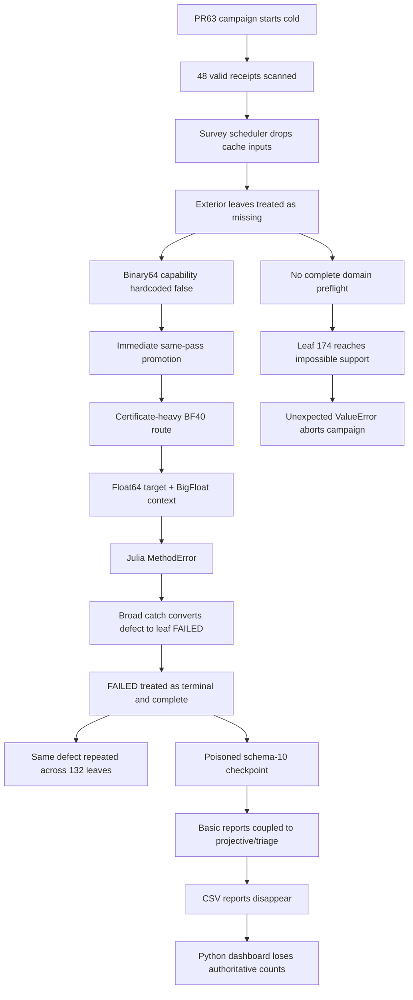
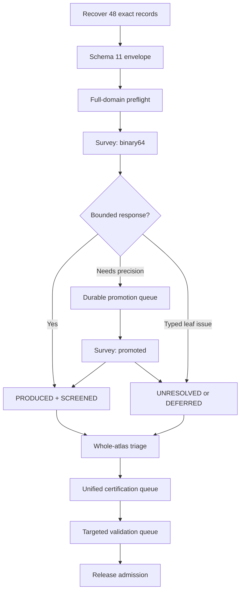

Yes. This is the merged map I would now treat as the authoritative PR64 specification.

The attached plan is substantially correct, but I have removed the unsupported “human review”/“airgap” framing, separated proven facts from proposed policy, corrected two technical gates, and integrated the clean-tail dashboard into the repair architecture.

## 1. What actually happened



The production status identifies the operation as `campaign-run`, not resume. Therefore the best-supported reconstruction is:

1. PR63 began a fresh campaign.
2. It found the solved-leaf cache.
3. The survey branch failed to receive/use those cache results.
4. Valid exterior evidence was recomputed.
5. The broken promoted route replaced those results with failures.

The exact damage baseline is now pinned and internally consistent:

| Recovered evidence | Count |
|---|---:|
| Terminal receipts | 48 |
| PRODUCED | 45 |
| UNRESOLVED | 3 |
| FAILED | 0 |
| Horizon | 28 |
| Exterior light ring | 20 |
| Duplicate leaf IDs | 0 |

The CSV is the recovery oracle, but the recovery command must still verify every listed receipt and record hash against the actual solved-leaf store.

## 2. Corrections to the attached PR64 map

### Correction A — do not restore `execute_stage_with_predictor()`

Claude’s suggested wiring would restore binary64 execution, but through the historical full component engine and signed perturbed-root ladder. That is not the cheap survey requested.

The new exterior binary64 path must be a dedicated fixed-root calculation:

\[
D_0,\quad D_\omega,\quad D_c,\quad \delta\omega=-D_c/D_\omega
\]

using the existing derivative-disk and quotient mathematics.

### Correction B — evidence and pass disposition must not share `SCREENED`

Use four distinct layers:

| Layer | Values | Meaning |
|---|---|---|
| Numerical record | Existing numerical states | The retained scientific centre and disk |
| Evidence ledger | `SCREENED`, `CERTIFIED`, `VALIDATED` | Strength of evidence around that record |
| Survey-pass ledger | `NOT_ATTEMPTED`, `CACHE_REUSED`, `COMPLETED`, `PROMOTION_PENDING_ROOT`, `PROMOTION_PENDING_RESPONSE`, `DEFERRED` | Scheduler progress |
| Attempt/system ledger | Typed failures and diagnostics | Operational history; never scientific completion |

This prevents another state-model collision.

### Correction C — do not require a BF40→binary64 certificate to pass merely because the Julia type signature is fixed

The type repair must allow conversion between differently typed contexts. Direct dispatch tests must pass.

But a complete BF40→binary64 empirical certificate can still legitimately fail its reliable-digits contract. Therefore:

- promoted survey must not call the certificate at all;
- direct context-conversion tests must pass;
- certification uses a cross-tier pairing that satisfies the existing precision contract;
- BF40→binary64 certification is not a merge gate unless its numerical evidence contract is separately and explicitly defined.

### Correction D — near-extremal support is resolved explicitly, without a floating TODO

The proposed rule comes from the attached map:

\[
g=r_\text{centre}-r_+,\qquad
s=\min(5\times10^{-4},g/4),\qquad
w=\min(w_\text{nominal},g-s)
\]

PR64 should implement this as a versioned support policy, not as an invisible tweak:

```text
adaptive-exterior-gap-standoff/v2
```

Required tests must prove:

- all selected domains are valid before leaf 1;
- support remains strictly outside the horizon;
- moderate-spin mappings remain identical wherever expected;
- changed mappings receive changed computation identities;
- no old receipt is reused where the support mapping differs.

There is no placeholder review ritual. The formula, identity change, invariants, and resulting domains are directly reviewable in the PR.

### Correction E — no “airgap” framing

The validation split is ordinary environment-specific testing:

- development and CI run all permitted software, schema, migration, contract, orchestration, and static worker tests;
- commit-bound Windows tests exercise the actual PowerShell/Python/Julia boundaries;
- no production campaign is used as the first integration test.

## 3. Target execution architecture



There is no automatic transition between the four computational passes:

```text
survey / binary64
survey / promoted
certify
validate
```

## 4. Exact pathways

### Recovery

1. Preserve schema-9, poisoned schema-10, solved-leaf store and root-readout store.
2. Hash all inputs.
3. Construct a new schema-11 checkpoint; never rewrite the schema-9 source.
4. Restore the 48 exact numerical record mappings.
5. Verify record hashes, receipt hashes, stage hashes, leaf identity and scientific identity.
6. Derive evidence receipts separately.
7. Generate basic reports.
8. Produce a recovery receipt.
9. Cut over only through a verified backup and atomic replacement.

Recovery loads no numerical backend and launches no Julia process.

### Binary64 horizon survey

```text
exact cache hit
→ retain exact record
→ zero numerical work

missing leaf
→ existing efficient binary64 horizon route
→ bounded disk: PRODUCED + SCREENED
→ typed numerical insufficiency: queue for promoted survey
```

The promoted horizon pass uses the existing BF80 analytic horizon route. No BF120 survey escalation.

### Binary64 exterior survey

For every exterior mechanism:

```text
authenticated sealed ω₀
→ canonical zero-coupling D₀
→ Dω at ±h and ±h/2
→ existing root-seal correction check
→ mechanism-specific D_c at ±ε and ±ε/2
→ existing quotient-disk calculation
→ SCREENED or promotion disposition
```

Hard budgets:

| Work | First mechanism/background | Exact Dω reuse |
|---|---:|---:|
| Root reads | 0 | 0 |
| D₀ samples | 1 | 0 |
| Dω samples | 4 | 0 |
| D_c samples | 4 | 4 |
| Maximum determinant samples | 9 | 4 |
| Julia launches | 0 | 0 |

Dω reuse requires exact equality of root seal, determinant family, normalization, controls, precision, backend, background identity and canonical zero-coupling operation. D_c is never shared.

### Promoted survey

Executed only by the second survey command.

- Horizon: existing BF80 route.
- Exterior response promotion: BF40 raw fixed-root samples, then BF80 only for typed arithmetic insufficiency.
- Exterior root promotion: at most one PRIMARY promoted root solve, followed by fixed-root response samples.
- No BF120.
- No truncation, resolution or seed-path root phases.
- No endpoint-pair, tight-control or cross-precision certificate.
- No automatic certification.

### Triage, certification and validation

After survey accounting:

- triage ranks unresolved, near-zero, large relative disks, derivative disagreement, branch risk, projective controllers and mechanism/mode sentinels;
- certification consumes one unified mixed-role queue;
- validation consumes explicit publication/risk selections;
- neither may silently replace the retained centre;
- a result outside the screened disk produces a discrepancy receipt;
- SCREENED-only leaves remain excluded from release admission.

## 5. Failure semantics

| Failure class | Action |
|---|---|
| Typed binary64 arithmetic insufficiency | Queue promotion |
| Typed promoted arithmetic insufficiency | BF80, then UNRESOLVED |
| Typed leaf-specific resource/control outcome | UNRESOLVED, DEFERRED or REJECTED according to existing semantics; continue |
| Cache identity mismatch | Cache miss if identities genuinely differ; abort if an allegedly exact receipt is corrupt |
| Python/Julia contract defect, schema defect, malformed worker response, unexpected exception | Write system-failure receipt and abort immediately |
| Repeated identical backend fingerprint | Circuit breaker aborts before another leaf begins |

`FAILED` remains visible as an operational/system count, but it is not a terminal numerical leaf state, not resume-skippable and not campaign completion.

## 6. Dashboard integration into `progress_output.py`

The PowerShell dashboard’s valuable characteristic is not its exact script—it is its append-only presentation model:

- print every historical completion once;
- append each new completion once;
- append a live line only on state change or heartbeat;
- never redraw the screen;
- preserve scrollback;
- use restrained colour and a compact table;
- reconstruct historical timings from telemetry and mark them with `~`.

The current Python dashboard does the opposite: `_dashboard()` moves the cursor upward and erases the dashboard region, while evidence counts depend on `_campaign_report_model` and become zero when report generation fails.

### Target Python implementation

Introduce a presentation-only `CleanTailViewModel` and `CleanTailRenderer` inside `progress_output.py`.

`ProgressMode.NORMAL` for M02 should use this renderer:

| Section | Required content |
|---|---|
| Banner | M02 dashboard, checkpoint, profile and survey pass |
| Campaign summary | Central responses, binary64 attempted, promotion queued, SCREENED, CERTIFIED, VALIDATED, UNRESOLVED, REJECTED and system FAILED |
| Completed leaves | Time, ordinal, mode, spin, mechanism, tier timings, total time, response magnitude, relative disk, numerical state and evidence level |
| Live execution | Profile/pass, current leaf, mechanism, tier, phase, sample/root budget, determinant, suboperation, tier/leaf elapsed and last-activity age |
| Diagnostics | Stale heartbeat, report degradation, cache publication failure or system-failure receipt |

Implementation rules:

- no cursor-up escape;
- no `ESC[0J`, `ESC[2J` or `Clear-Host`;
- initial completed rows come from the checkpoint/basic projection, not exclusively from CSV availability;
- evidence counts come directly from the schema-11 ledger;
- report failure displays `REPORTS DEGRADED` but does not erase or zero campaign state;
- timing tiers are registry-driven and include binary64, BF40, BF80 and BF120 when present;
- historical interrupted-session timing is summed and marked `~`;
- mechanism and mode rendering is plan/registry-driven, not hard-coded to seven modes;
- the presentation timing sidecar, if retained, is explicitly non-scientific and cannot modify checkpoint evidence.

`M02-Dashboard.ps1` can remain as a read-only-to-evidence external viewer, but Python becomes the authoritative in-process implementation. The PowerShell script currently writes a presentation timing sidecar, so it is not literally filesystem-read-only.

Required dashboard regressions:

1. Historical completions print exactly once at startup.
2. A new completion appends exactly once.
3. State-change and 30-second heartbeat lines append correctly.
4. No screen-clearing/redraw ANSI appears.
5. Schema-11 evidence/pass counts remain correct without advanced reports.
6. Forced projective/triage failure leaves the dashboard and basic tables usable.
7. Interrupted timing sessions are summed and marked `~`.
8. Layout snapshots pass at 108-column and compact widths.
9. Windows ANSI-disabled fallback remains readable.
10. Profile, pass and promotion queue are visible.

This becomes break B16: operator presentation was coupled to fragile report projection and a redraw model that obscured rather than clarified campaign history.

## 7. Ordered implementation and PR sequence

| Order | Deliverable | Hard gate |
|---:|---|---|
| 0 | Pure PR63 revert on a verified current-main branch | Pre-PR63 suite restored |
| 1 | Freeze forensic archives and 48-row oracle | Counts and hashes pinned |
| 2 | Schema-11 immutable numerical records plus separate ledgers | Evidence upgrade leaves record hash unchanged |
| 3 | Deterministic recovery into schema 11 | Exact 48 records; no backend loading |
| 4 | Cache-first scheduling and monotone record merge | Cached leaf causes zero backend calls |
| 5 | Typed failure classifier and circuit breaker | Wrapped `MethodError` aborts before next leaf |
| 6 | Basic-report separation | Basic CSVs survive advanced-report failure |
| 7 | Versioned support policy and full-plan preflight | All selected domains valid before leaf 1 |
| 8 | Real binary64 fixed-root exterior primitive | ≤9 samples, zero root reads, zero Julia |
| 9 | Explicit binary64 survey pass and promotion queue | Full mocked plan launches zero Julia |
| 10 | Survey-screening Julia profile plus type-boundary repair | Raw promoted samples cannot invoke certificate |
| 11 | Explicit promoted survey pass | BF40→BF80 only on typed insufficiency |
| 12 | Unified certification and validation queues | Heavy work occurs only under explicit profile |
| 13 | Whole-atlas triage | Deterministic mixed-role certification queue |
| 14 | Clean-tail Python dashboard and PowerShell orchestration | Append-only Windows rendering tests |
| 15 | Focused regressions, then draft PR | Review surface opens without waiting for full suite |
| 16 | Full suite, static worker tests and commit-bound native canaries | Required before leaving draft |

Native canaries should cover:

- exact recovery;
- cache reuse plus one missing binary64 exterior leaf;
- promoted response leaf;
- certification leaf;
- injected `MethodError` immediate abort;
- clean-tail dashboard behavior.

## Definition of done

```text
Recovered exact records            48/48
Recovered failures                 0
Cached terminal recomputations     0
Binary64 exterior Julia launches   0
Inline promotions                  0
Survey certificates                0
Survey diagnostic root ladders     0
Repeated systemic failures         0
Basic reports after every commit   present
Dashboard redraw/clear operations  0
Promotion queue                    explicit and durable
Certification queue                unified and mixed-role
Validation                         explicit only
Release admission                  rejects SCREENED-only
```

The controlling rule remains:

> Acquire and preserve the central atlas with the minimum existing evidence needed to screen each response; spend extreme computation only in later, separately invoked passes, and never let a newer policy erase stronger evidence already paid for.
