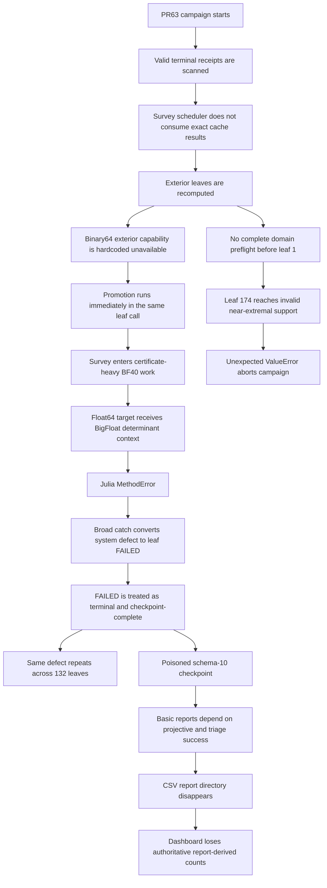

# PR #64 — Governing Completion Contract

## M02 recovery, survey separation, evidence architecture, reporting, and dashboard repair

> **Authority:** This document is the governing completion contract for PR #64. It supersedes the PR #63 implementation plan, the PR #63 repair-chain draft, and any narrower issue-specific repair instructions. A change that conflicts with this document is not an implementation choice; it is a PR #64 defect.
>
> **Product rule:** PR64 must produce a general-purpose solver. It must work on a fresh machine with zero prior receipts, on a partially completed campaign with any number of compatible receipts, and on a complete campaign. No operator-specific archive, receipt count, checkpoint hash, or forensic oracle is a runtime prerequisite.
>
> **Execution rule:** The development agent may write, edit, inspect, statically validate, and run permitted software tests. It must not execute the production Kerr/GSN campaign or any production mathematical canary. Native PowerShell/Python/Julia acceptance is run by the operator and returned as logs.
>
> **Branch rule:** PR #64 is append-only. Do not force-push, reset the remote branch, or close/recreate the PR. If local history diverges, rebuild local work from the current remote PR64 head and replay or reconstruct intended commits so every push is a normal fast-forward.
>
> **Merge rule:** Passing hosted checks, the full permitted suite, and mandatory native canaries does not automatically remove draft status. PR #64 remains draft until the operator personally reviews the exact-head acceptance receipt and gives explicit landing approval. Only then may the protected merge path be requested. No automated agent may mark the PR ready or merge it merely because checks pass.
>
> **For `@PR Completion`:** Treat every invariant, gate, prohibition, artifact, and canary in this document as mandatory. Do not scope-reduce the repair to the currently failing mechanism, do not substitute a mocked proof for a named native boundary, do not move an unmet mandatory gate into follow-up work, do not confuse an incident-specific regression fixture with the product’s operating contract, and do not infer an unresolved implementation decision where this contract has closed it.

---

## 1. Objective

PR #64 must restore the objective PR #63 was supposed to implement:

> **Preserve every valid terminal result available to the operator; acquire the remaining central atlas with the minimum explicit evidence needed to screen each response; persist precision escalation as a separate queue; and reserve expensive certification and independent validation for later, separately invoked passes.**

The product must support all three starting conditions:

```text
NEW CAMPAIGN
  zero checkpoint records
  zero solved-leaf receipts
  zero root-readout receipts

RESUME
  one compatible checkpoint
  zero or more compatible cache receipts

RECOVER
  zero or more compatible historical checkpoints/stores
  produce a new validated checkpoint without numerical recomputation
```

All three converge on the same staged execution architecture:

```text
RECOVER OR NEW/RESUME
→ SURVEY / BINARY64
→ SURVEY / PROMOTED
→ TRIAGE
→ CERTIFY
→ VALIDATE
→ RELEASE ADMISSION
```

There is no automatic transition from one computational pass to the next.

The controlling scientific relation for an exterior survey response is:

```text
δω = −D_c / Dω
```

where the central root is sealed, Dω is the fixed-root frequency derivative, and D_c is the fixed-root mechanism derivative. Survey obtains a bounded central response. Certification constructs the stronger local uncertainty package. Validation supplies independent publication evidence.

---

## 2. Product universality and incident-fixture boundary

This distinction is mandatory.

| Concern | Governing rule |
|---|---|
| Fresh installation | Requires no historical checkpoint, receipt archive, root-readout archive, or oracle |
| Ordinary resume | Reuses however many exact compatible records exist; the count may be 0…N |
| Generic recovery | Authenticates and preserves every valid compatible terminal record supplied; the count is discovered, not prescribed |
| PR63 forensic regression | May use a frozen incident fixture and an expected-output oracle to prove recovery of that specific historical state |
| Missing incident fixture | Prevents claiming that one incident canary passed; it does not block implementation, normal operation, generic recovery, review, or any unrelated mandatory test |
| Production code | Must not contain Ben-specific archive hashes, filenames, receipt counts, or expected leaf IDs |

The generic invariant is:

```text
valid compatible terminal records supplied     N
valid compatible terminal records recovered    N
lost valid records                              0
fabricated records                              0
```

`N` may be zero.

A fresh user must be able to run:

```powershell
.\m02.ps1 -NewCampaign -Checkpoint <new-path>
```

with an empty solved-leaf store and an empty root-readout store.

A user with 7 valid receipts reuses 7. A user with 42 reuses 42. A user with 48 reuses 48. The algorithm must never contain `expected_receipt_count == 48`.

---

## 3. Verified PR63 incident baseline

The following facts describe the PR63 incident. They are forensic evidence and regression expectations, not product prerequisites.

| Quantity | Pre-PR63 schema 9 | Post-PR63 schema 10 |
|---|---:|---:|
| Records | 41 | 173 |
| PRODUCED | 39 | 30 |
| UNRESOLVED | 1 | 0 |
| IN_PROGRESS | 1 | 0 |
| FAILED | 0 | 143 |

The originally audited solved-leaf material was reported as:

| Incident recovery expectation | Count |
|---|---:|
| Total terminal receipts | 48 |
| PRODUCED | 45 |
| UNRESOLVED | 3 |
| FAILED | 0 |
| Horizon admittance | 28 |
| Exterior light ring | 20 |
| Duplicate leaf IDs | 0 |

Cross-mapping the audited receipts into the poisoned schema-10 checkpoint showed:

```text
PRODUCED → PRODUCED       28
PRODUCED → FAILED         17
UNRESOLVED → FAILED        3
```

Repeated production failures were:

```text
EXTERIOR_DETERMINANT_CERTIFICATE_UNAVAILABLE    132
INSUFFICIENT_ASYMPTOTIC_PRECISION                10
HORIZON_MAXIMUM_ORDER_INADEQUATE                  1
```

The terminal campaign failure occurred at leaf 174/212:

```text
ValueError: exterior profile has no smooth support outside horizon
mechanism: exterior-light-ring
root: 220 a/M=0.999998
```

### 3.1 PR63 incident regression fixture

The following hashes identify the reviewed PR63 incident materials when those exact files are available:

| Artifact | SHA-256 |
|---|---|
| `m02-campaign-checkpoint(20260822-004719).json` | `b62f9e6c1c901cd7eee907b99d387bdc1e86be5019b5d4efd11fa28997015d35` |
| `solved-leaves-v1(3).zip` | `2d2fe86e1f2c7f5b75fbc9aa3c8b9a64cfc687f6f3640bb0ba9c571bf9b7a8a2` |
| `root-readouts-v2(2).zip` | `69aa3b2b112a7208d1444ccf564b2c0ef767d4b78e06e41f7c37b85a104b3376` |
| `m02-output(2).zip` | `8f9cb16f91ce7e59462d4f5d4ba5c672aac1689ddce30655f3b82fe9199663c3` |
| `windows_solver(1).zip` | `d2de00ff4db861022f0bd08a8032928fc703c8a551d1caf33f7187a997c98343` |
| `data.zip` | `560c65e96bb404f282ccea702a28b16500eb2f6ae4fa78e76ba70bf29bdda59a` |
| `PR64_RECOVERY_BASELINE.csv` | `7f840ead76af8c11d89f32b6e96739bde2af2846cd823ced1b7cd331226bab5c` |
| `PR64_RECOVERY_BASELINE.json` | `898b267b821cb22fc64c78211e9987dd5980bc1ff1377d45d3bed06abb2c975d` |

These are **incident-test fixture identities only**.

They must not be:

- embedded in production recovery code;
- required by installation or ordinary campaign execution;
- required before implementation can proceed;
- used as the campaign ID or cache identity;
- treated as proof that a differently supplied archive must contain 48 receipts.

When the complete matching incident fixture and oracle are supplied, the incident canary expects 48/45/3/0. When the supplied fixture contains fewer valid receipts, generic recovery must recover the valid subset exactly and report the incident fixture as incomplete. It must not fabricate missing receipts and must not halt unrelated implementation work.

---

## 4. Verified failure chain



### 4.1 Break register

| ID | Break | Verified target | Required repair |
|---|---|---|---|
| B01 | PR63 merged before native operator gates passed | PR #63 process | PR64 remains draft until commit-bound native acceptance passes |
| B02 | Survey computes cache lookups but does not consume them | `response_batches.py` survey dispatch | Cache-first scheduler; exact terminal record reused before backend construction |
| B03 | Binary64 exterior survey is a static false capability result | `NativeCampaignStageBackend._binary64_exterior_survey_preflight()` | Delete the stub; implement a real fixed-root binary64 survey primitive |
| B04 | Promotion is immediate same-pass execution | survey scheduler and promoted dispatcher | Explicit binary64 and promoted survey passes with a durable queue |
| B05 | Promoted survey uses certificate-heavy determinant requests | promoted survey and worker request policy | Add a survey-only raw fixed-root worker operation that cannot invoke certification |
| B06 | `precision_guard_context` binds source and target to the same Julia type | `m02_worker.jl` | Separate source and target type parameters; direct boundary tests |
| B07 | Broad exception containment converts infrastructure defects into leaf failures | survey-stage containment | Typed failure classifier; system defects abort immediately |
| B08 | `FAILED` is treated as scientific terminal completion | checkpoint validation and resume sets | Remove `FAILED` from numerical terminal and completion semantics |
| B09 | Existing stronger terminal evidence can be superseded | cache/recovery merge boundary | Exact terminal record immutability and monotone evidence upgrade |
| B10 | Schema transition has no mandatory verified rollback point | `m02.ps1` and checkpoint writes | New-destination recovery, verified backup, atomic cutover receipt |
| B11 | Absolute support constants fail near extremality | `response_engine.py` exterior support | Versioned gap-scaled support policy and full-plan preflight |
| B12 | Basic CSVs depend on advanced projective/triage generation | `campaign_reports.py` | Independent basic report transactions and durable report-status artifact |
| B13 | Tests validate mocks/stubs but not production boundaries | PR63 tests | Real request-contract fixtures plus operator-run native canaries |
| B14 | Evidence metadata changes the canonical numerical record hash | PR63 record model | Separate evidence ledger; numerical records remain immutable |
| B15 | Survey has no hard work budget | survey kernel and scheduler | Enforced determinant/root/worker budgets; budget breach is a system defect |
| B16 | Main dashboard uses fragile multi-line redraw/report coupling | `progress_output.py` | Checkpoint-led clean-tail renderer with one steady live line |
| B17 | Main launcher can silently start cold when checkpoint path is absent | `m02.ps1` | Resume by default; cold start only with explicit `-NewCampaign` |
| B18 | Fixed-root timing is not durably represented by root telemetry | progress/timing path | Pass/tier timing ledger plus append-only interruption telemetry |
| B19 | Incident fixture was conflated with product recovery contract | recovery specification | Count-agnostic generic recovery; fixture-specific expectations isolated to one optional regression |

---

## 5. Non-negotiable invariants

1. **The solver works with zero prior evidence.** A fresh user can create and execute a new campaign without historical artifacts.
2. **Generic recovery is count-agnostic.** It preserves every valid compatible terminal record supplied, where the count may be zero or any positive integer.
3. **Every recovered terminal record is immutable.** Its numerical mapping, stages, hashes, state, and scientific identity survive unchanged.
4. **PR63 incident counts are fixture expectations only.** No production path depends on 48 receipts or any listed archive SHA-256.
5. **The poisoned schema-10 checkpoint is forensic evidence only.** It is never resumed or used to overwrite a recovered record.
6. **Recovery performs no numerical work.** It must not construct a determinant backend, load a Julia adapter, launch Julia, solve an ODE, solve a root, or evaluate a determinant.
7. **Exact cache lookup precedes backend construction.** A terminal cache hit results in zero backend calls.
8. **A valid PRODUCED record never becomes UNRESOLVED, REJECTED, FAILED, or a different numerical record.**
9. **A valid UNRESOLVED record remains terminal on ordinary resume.** It runs again only through an explicit requeue bound to a changed scientific policy or operator selection.
10. **Binary64 survey launches no Julia process.**
11. **Promotion is never inline.** Binary64 survey records a durable queue entry and advances.
12. **Promoted survey is not certification.** It performs minimal fixed-root work only.
13. **Survey never invokes endpoint-pair, tight-control, cross-precision certificate, TRUNCATION, RESOLUTION, SEED-PATH, full signed-root ladder, or independent publication validation.**
14. **BF120 is forbidden in survey.**
15. **No survey response runs a root solve after a valid root seal exists.**
16. **A system or contract defect aborts immediately.** It is never converted into a terminal numerical leaf.
17. **`FAILED` is operational, not scientific.** It never counts as campaign completion or resume-skippable numerical evidence.
18. **All selected domains and request contracts preflight before leaf 1.**
19. **Basic CSV reports survive projective and triage failure.**
20. **The checkpoint and ledgers are authoritative.** The dashboard and CSVs are projections.
21. **The main dashboard never performs multi-line redraw.** Historical and completed rows append once; live execution occupies one bounded line.
22. **No execution, cache, report, dashboard, queue, or triage code is hard-coded to the current seven modes.**
23. **Every current exterior mechanism crosses the same repaired architecture.**
24. **No scientific tolerance is weakened to make a repair pass.**
25. **No full campaign is used as the first integration test.**
26. **Missing incident fixtures do not block implementation.** They block only the matching incident-specific canary and any exact incident-recovery claim.
27. **PR64 branch history is append-only.** No force-push, remote reset, or PR recreation is permitted.
28. **Duplicate compatible evidence has deterministic precedence.** Numerical mappings remain byte-identical; compatible evidence is unioned monotonically; timestamps never decide scientific precedence.
29. **Legacy compatibility is deterministic and fail-closed.** A missing schema-11-only identity may be reconstructed only when authenticated historical data determines it uniquely.
30. **Any invalid selected support or request domain aborts preflight before leaf 1.** It is not recorded as REJECTED or DEFERRED merely to continue.
31. **The first cross-mechanism Dω reuse requires a durable `background-equivalence/v1` receipt in addition to an exact reuse-key match.**
32. **Promotion uses a closed static allowlist.** No broad typed-CONTROL fallback may request higher precision.
33. **UNRESOLVED and DEFERRED are distinct.** UNRESOLVED means survey numerics are exhausted; DEFERRED means intentionally postponed without declaring numerical exhaustion.
34. **The corrected governing dashboard contract is authoritative.** `M02-Dashboard.ps1` is a visual and ergonomic reference only, not a second authoritative renderer.
35. **Native canaries use `examples/m02-campaign.json` and bind to the exact plan emitted by the tested PR head.** Legacy audited IDs authenticate recovery material but are not hard-coded production expectations.
36. **Passing all gates leaves PR64 draft.** The implementation agent presents the acceptance receipt and stops until explicit operator landing approval.

---

## 6. Scope

### 6.1 In scope

- Revert the PR63 execution architecture while preserving unrelated later work where possible.
- Implement count-agnostic generic recovery into schema 11.
- Recover every valid compatible terminal record available to the operator.
- Support fresh campaigns with zero historical evidence.
- Keep the PR63 48-row oracle as an optional incident regression fixture.
- Add separate evidence, survey-pass, promotion-queue, timing, attempt, and system-failure ledgers.
- Restore cache-first scheduling.
- Implement real binary64 fixed-root exterior survey for every selected exterior mechanism.
- Implement explicit promoted survey, certification, and validation passes.
- Add a survey-only Julia raw-sample operation.
- Repair Julia cross-type context conversion used by certification.
- Implement the versioned near-extremal support policy.
- Preflight the complete selected plan before numerical execution.
- Decouple basic reports from projective and triage outputs.
- Replace the main Python dashboard with the clean-tail presentation model.
- Add commit-bound native PowerShell acceptance gates.
- Preserve future K2 compatibility without adding 332 or 442 to the production plan.

### 6.2 Out of scope

- Adding production K2 modes 332 or 442.
- Changing Kerr, Teukolsky, Sasaki–Nakamura, angular, or QNM equations.
- Replacing the established determinant family or normalization.
- Weakening root, branch, derivative, or release-admission tolerances.
- Automatically certifying or validating all leaves during survey.
- Using the poisoned schema-10 checkpoint as recovered scientific source.
- Making any operator-specific fixture a product dependency.
- Running the production campaign from the development agent’s environment.

---

## 7. Schema 11: exact state architecture

PR64 separates numerical state, evidence strength, scheduler progress, operational attempts, system failures, recovery provenance, and reporting status.

### 7.1 Envelope

```json
{
  "schema_version": 11,
  "campaign_id": "...",
  "selection_id": "...",
  "state": "PARTIAL",
  "records": [],
  "evidence_ledger": {},
  "survey_pass_ledger": {
    "binary64": {},
    "promoted": {}
  },
  "promotion_queue": {
    "schema": "windows-solver.m02-promotion-queue/1",
    "entries": []
  },
  "attempts": [],
  "system_failures": [],
  "recovery_receipts": [],
  "report_status_receipt": null
}
```

The canonical numerical record array remains independent of changing evidence and scheduler metadata.

### 7.2 Numerical record layer

Allowed meanings:

```text
IN_PROGRESS      transient only
PRODUCED         finite retained central response and disk
UNRESOLVED       computation completed but no admissible bounded response
REJECTED         scientific/domain rejection under an explicit rule
```

`FAILED` is not an allowed schema-11 numerical terminal state.

### 7.3 Evidence ledger

Monotone levels:

```text
none → SCREENED → CERTIFIED → VALIDATED
```

Definitions:

- **SCREENED:** finite central response and bounded local disk; authenticated root/branch identity; Dω excludes zero; cheap derivative refinement agrees.
- **CERTIFIED:** required local uncertainty and authentication evidence is present under explicit certification policy.
- **VALIDATED:** explicit independent/publication validation is present.

Evidence upgrades never rewrite the central numerical record. A result outside the retained disk records a discrepancy.

### 7.4 Survey-pass ledger

Allowed binary64 dispositions:

```text
NOT_ATTEMPTED
CACHE_REUSED
COMPLETED
PROMOTION_PENDING_ROOT
PROMOTION_PENDING_RESPONSE
UNRESOLVED
DEFERRED
REJECTED
SUPERSEDED_BY_CACHE
```

Allowed promoted dispositions:

```text
NOT_ATTEMPTED
CACHE_REUSED
COMPLETED
UNRESOLVED
DEFERRED
REJECTED
SUPERSEDED_BY_CACHE
```

Each entry binds leaf ID, pass identity, source/result hashes, operation identity, precision tiers, reason code, work budgets, timing, session fragments, and disposition receipt.

Disposition meanings are exact:

```text
PROMOTION_PENDING_ROOT / PROMOTION_PENDING_RESPONSE
= the current pass cannot produce a bounded response and a declared later survey tier remains available

UNRESOLVED
= all arithmetic tiers and work permitted by the current survey policy have been exhausted without an admissible bounded response

DEFERRED
= execution is intentionally postponed by explicit policy, resource scheduling, or operator instruction; numerical exhaustion is not asserted

REJECTED
= a validly constructed leaf fails an explicit scientific/domain rejection rule; invalid plan construction is not converted into REJECTED
```

Examples:

```text
binary64 insufficiency with BF40 available       → PROMOTION_PENDING_*
BF40 insufficiency with BF80 allowed              → continue inside promoted pass
BF80 still cannot bound the response              → UNRESOLVED
operator/policy postpones an otherwise valid leaf → DEFERRED
```

### 7.5 Promotion queue

Queue entries are append-only and receive terminal outcomes:

```text
PENDING
COMPLETED
UNRESOLVED
DEFERRED
SUPERSEDED_BY_CACHE
```

They are never silently deleted.

### 7.6 Attempts, failures, and recovery receipts

- Leaf-local typed outcomes append to `attempts`.
- Infrastructure defects append to `system_failures` and abort the active pass.
- Generic recovery appends a receipt recording discovered candidates, accepted records, rejected/corrupt candidates, conflicts, and output hashes.
- An optional incident-oracle result is a field inside a recovery receipt, not a production identity.

### 7.7 Completion meanings

```text
binary64 pass complete
= every selected leaf has a terminal binary64 disposition

promoted pass complete
= every queued promotion has a terminal promoted disposition

central atlas complete
= every selected leaf is PRODUCED or UNRESOLVED

release admissible
= every publication-required component has the required evidence level
```

---

## 8. Recovery architecture

### 8.1 Generic public command

Add a generic no-numerics command:

```text
solver campaign-recover SELECTION.json
    --output RECOVERED.json
    [--source-checkpoint CHECKPOINT.json]...
    [--solved-leaf-store STORE]...
    [--root-readout-store STORE]...
    [--oracle OPTIONAL-INCIDENT-ORACLE.csv]
    --receipt RECOVERY-RECEIPT.json
```

PowerShell wrapper:

```powershell
.\m02-recover.ps1 `
  -Selection .\examples\m02-campaign.json `
  -OutputCheckpoint .\m02-output\m02-campaign-checkpoint.schema11.candidate.json `
  -Receipt .\m02-output\m02-recovery-receipt.json `
  -SourceCheckpoint <optional> `
  -SolvedLeafStore <optional> `
  -RootReadoutStore <optional>
```

All source arguments are optional. Supplying no historical source is valid and creates an empty schema-11 candidate for the selected campaign.

`--oracle` is optional and fixture-specific. Production recovery logic must work without it.

### 8.2 Candidate discovery

Recovery:

1. loads the current plan and selection without constructing a numerical backend;
2. scans every supplied source for candidate terminal records;
3. authenticates each candidate independently;
4. groups candidates by exact scientific computation identity;
5. applies deterministic conflict rules;
6. writes every accepted exact terminal record to a new destination;
7. writes rejected/corrupt candidate diagnostics to the recovery receipt;
8. never modifies source artifacts.

### 8.3 Acceptance and conflict rules

For each candidate validate:

```text
outer receipt hash
record hash
stage hashes
leaf ID and role
terminal state
root/equation/branch identity
mechanism/support identity
policy identity
backend/scientific identity
selection membership
```

Rules:

```text
one valid candidate                         → accept
multiple candidates with identical numerical mappings
                                            → preserve one byte-identical canonical numerical record
                                            → union every compatible monotone evidence receipt in the separate evidence ledger
conflicting terminal centres or states      → abort recovery
corrupt alleged exact receipt               → abort recovery
off-selection compatible record             → report and ignore
```

Evidence strength is ordered:

```text
VALIDATED > CERTIFIED > SCREENED > none
```

After evidence level, prefer greater authenticated evidence completeness. Authenticated precision is only a tiebreaker when it represents genuinely stronger evidence under the same scientific computation identity. Creation or modification timestamp is never scientific precedence. If otherwise equivalent outer receipts still need deterministic ordering, use canonical receipt SHA-256 ordering.

The numerical record is never replaced merely because another wrapper is newer or carries stronger evidence. Stronger evidence is appended to the separate ledger. No heuristic chooses a different centre.

#### 8.3.1 Legacy compatibility adapter

A historical checkpoint or receipt may lack a schema-11-only identity field. Recovery must not automatically discard valid historical evidence, fabricate a value, or abort merely because a later schema added a field.

A deterministic legacy adapter may issue a `legacy-compatibility/v1` receipt only when authenticated historical content reconstructs the missing identity uniquely and the realised scientific mapping is exactly compatible.

For support identity:

```text
legacy receipt lacks support_policy_identity
→ reconstruct the legacy realised lower / upper / centre / half-width and all other scientific identities
→ compare against the current realised mapping
→ exact compatible mapping
    → issue legacy-compatibility/v1 receipt
    → reuse permitted
→ changed or non-uniquely reconstructable mapping
    → preserve as forensic input
    → treat as incompatible cache miss
```

An allegedly exact receipt that is internally corrupt still aborts. The adapter never guesses and never treats a missing field alone as proof of compatibility.

### 8.4 Generic recovery gate

For input containing `N` valid compatible unique terminal records:

```text
discovered valid unique records       N
recovered records                     N
lost valid records                    0
fabricated records                    0
record-hash changes                   0
backend constructions                 0
Julia launches                        0
determinant evaluations               0
root solves                           0
source mutations                      0
```

This is the mandatory product recovery contract.

### 8.5 Optional PR63 incident canary

When the complete reviewed PR63 fixture and oracle are supplied, additionally assert:

```text
recovered terminal records    48
PRODUCED                       45
UNRESOLVED                      3
FAILED                          0
horizon                        28
exterior light ring           20
```

When the supplied archive contains fewer oracle-listed receipts:

```text
generic recovery                    continues and recovers all valid supplied records
incident oracle status              INCOMPLETE_FIXTURE
missing oracle entries              listed explicitly
fabricated entries                  0
exact 48-record incident claim      prohibited
implementation progress             not blocked
```

The implementing agent must not request the complete archive as a prerequisite to write or test the generic recovery engine.

### 8.6 Production cutover

Cutover is a separate explicit action:

```powershell
.\m02-recover.ps1 `
  -CommitCutover `
  -CandidateCheckpoint <candidate> `
  -RecoveryReceipt <receipt> `
  -ProductionCheckpoint <production>
```

Before replacement:

```text
create timestamped byte-for-byte backup
verify source/backup size and SHA-256
validate candidate from disk
stage candidate in same directory
fsync file
atomically replace production path
preserve backup and sources permanently
write cutover receipt
```

---

## 9. Public command surface

### 9.1 Normal resume

```powershell
.\m02.ps1
```

Equivalent:

```powershell
.\m02.ps1 -Profile survey -SurveyPass binary64
```

Normal invocation requires an existing checkpoint. Missing checkpoint means abort, not cold start.

### 9.2 Fresh campaign

```powershell
.\m02.ps1 -NewCampaign -Checkpoint <new-nonexistent-path>
```

Requirements:

- refuses an existing checkpoint;
- creates an empty schema-11 envelope;
- requires no historical receipts;
- preflights the complete selected plan;
- begins binary64 survey only;
- does not ask for an incident fixture.

### 9.3 Promoted survey, certification, and validation

```powershell
.\m02.ps1 -Profile survey -SurveyPass promoted
.\m02.ps1 -Profile certify
.\m02.ps1 -Profile validate -QueuePath <publication-selection>
```

No command automatically invokes the next pass.

### 9.4 Startup disclosure

Before execution print:

```text
Resolved checkpoint
Selected command
Execution profile
Survey pass
Selection ID
Checkpoint schema
Current terminal record count
Cache-compatible count
Binary64 pass count
Promotion queue count
Evidence counts
Basic report directory
Status path
```

No output labels historical receipts as required dependencies.

---

## 10. Full-domain preflight

Before leaf 1:

```text
resolve runtime/package receipts
→ load selection/checkpoint or create explicit new campaign
→ validate schema and campaign identity
→ authenticate any supplied cache indices
→ materialize every selected leaf
→ compute every support mapping
→ validate every mechanism/request contract
→ verify GSN/angular data availability
→ verify pass-specific arithmetic capabilities
→ validate queue bindings
→ generate current basic reports
→ begin execution
```

Preflight detects invalid support, unsupported mode/mechanism, missing data, malformed root receipt, request mismatch, stale queues, and checkpoint/selection mismatch before numerical work.

If any selected leaf has invalid exterior support or an invalid request/domain contract, the entire requested pass aborts before leaf 1. The defect is a plan/preflight failure. It is not converted into a leaf-level REJECTED or DEFERRED state merely to continue the campaign. REJECTED remains reserved for a validly constructed leaf that fails an explicit scientific rejection rule.

An empty historical cache is valid.

---

## 11. Cache-first execution

For every selected leaf:

```text
compute exact scientific computation identity
→ lookup solved-leaf/checkpoint terminal records
→ authenticate exact candidate
→ exact terminal hit?
```

Exact hit:

```text
reuse exact record mapping
→ preserve record hash and state
→ add CACHE_REUSED pass receipt
→ zero backend construction
→ zero determinant work
```

Miss:

```text
construct only the backend required for the requested pass
→ execute pass-specific operation
```

Conflict or corrupt alleged exact receipt:

```text
SYSTEM_FAILURE
→ durable receipt
→ abort
```

The cache may contain zero records.

---

## 12. Binary64 survey

### 12.1 Horizon

```text
exact terminal hit
→ reuse

missing horizon leaf
→ existing efficient binary64 horizon production route
→ bounded response: PRODUCED + SCREENED
→ typed arithmetic insufficiency: queue ROOT or RESPONSE promotion
→ no inline BF80
```

Promoted horizon survey uses the existing BF80 analytic route. BF120 is forbidden in survey.

### 12.2 Exterior fixed-root path

Do not call `execute_stage_with_predictor()` or the historical full component engine.

Inputs:

```text
authenticated root seal ω₀
branch identity
mechanism/support identity
binary64 controls
fixed-root survey operation identity
```

Work:

```text
D₀       = D(ω₀,0)
Dω(h)    = [D(ω₀+h,0) − D(ω₀−h,0)]/(2h)
Dω(h/2)  = [D(ω₀+h/2,0) − D(ω₀−h/2,0)]/h
D_c(ε)   = [D(ω₀,+ε) − D(ω₀,−ε)]/(2ε)
D_c(ε/2) = [D(ω₀,+ε/2) − D(ω₀,−ε/2)]/ε
δω       = −D_c/Dω
```

SCREENED requires exact root/branch identity, finite samples, Dω disk excluding zero, root correction ≤2×10⁻¹¹, finite D_c refinement, and a finite bounded quotient disk.

Routing:

```text
bounded response                     → PRODUCED + SCREENED
root correction needs precision      → PROMOTION_PENDING_ROOT
Dω or D_c needs precision            → PROMOTION_PENDING_RESPONSE
typed non-promotable numerical issue → UNRESOLVED or DEFERRED
system/contract defect               → abort
```

### 12.3 Hard budgets

| Work | First exact background | After exact Dω reuse |
|---|---:|---:|
| Root reads | 0 | 0 |
| D₀ samples | 1 | 0 |
| Dω samples | 4 | 0 |
| D_c samples | 4 | 4 |
| Maximum determinant samples | 9 | 4 |
| Julia launches | 0 | 0 |

Budget excess is a system failure.

---

## 13. Canonical exterior background and Dω reuse

Cross-mechanism reuse is permitted only through:

```text
canonical-exterior-background-wronskian/v1
```

It carries no mechanism-specific support and produces D₀/Dω under one unperturbed exterior path.

Exact key includes root seal, root/branch/angular identities, operation identity, determinant family/convention/normalization, readout/match convention, backend, controls, tier, working precision, and frequency-step policy.

The exact reuse key is necessary but not sufficient for the first cross-mechanism reuse. Before the first reuse for each mechanism/contract version, the system must produce and authenticate a durable:

```text
background-equivalence/v1
```

receipt proving that the canonical zero-coupling background operation and the mechanism-specific c=0 route represent the same determinant under the declared family, normalization, branch, controls, and match/readout convention.

```text
first reuse for a mechanism/contract version
→ exact reuse key matches
→ valid background-equivalence/v1 receipt exists
→ reuse permitted

subsequent reuse under the exact same authenticated contract
→ exact reuse key + valid equivalence receipt
→ no repeated equivalence calculation required
```

D_c is never shared.

If equivalence is not established, cross-mechanism Dω reuse is disabled and the mechanism-local 9-sample path remains valid. No optimistic reuse is permitted.

---

## 14. Promoted survey

Executed only by:

```powershell
.\m02.ps1 -Profile survey -SurveyPass promoted
```

It consumes only pending queue entries.

### 14.1 Response promotion

```text
reuse root seal
→ BF40 raw fixed-root survey batch
→ BF80 only on typed BF40 arithmetic insufficiency
→ SCREENED or UNRESOLVED
```

### 14.2 Root promotion

```text
BF40 fixed-root screening
→ at most one PRIMARY root solve if correction remains unresolved
→ BF80 only on typed BF40 insufficiency
→ seal root
→ fixed-root response batch
→ SCREENED or UNRESOLVED
```

After a root seal exists, no further root call is allowed.

Promoted survey forbids BF120, diagnostic root phases, endpoint-pair, tight-control, cross-precision certificate, publication derivative ladder, and independent validation.

---

## 15. Survey-only Julia operation

Add:

```text
operation: fixed-root-survey-batch
identity: exterior-fixed-root-survey-raw/v1
```

Request carries ordered sample roles, maximum sample count, fixed root, identities, tier, controls, and support only where D_c requires it.

The worker rejects duplicate, unknown, out-of-order, or over-budget roles.

The operation must not call:

```text
select_worker_outer_endpoint_pair
authenticated_determinant_progress
exterior_cross_precision_disagreement
tight_control_request
solve_phase
bounded_newton
```

One worker request per leaf/tier; batching is mandatory.

---

## 16. Julia precision boundary

Required signature:

```julia
function precision_guard_context(
    ::Type{T},
    evaluation_context::DeterminantRequestContext{S},
) where {T<:AbstractFloat,S<:AbstractFloat}
```

The body explicitly converts to T, creates fresh diagnostics/evidence state, preserves branch cell, and does not mutate source context.

Direct specifications cover BigFloat→Float64, BF80→BF40, BF120→BF80, branch mismatch, source immutability, and proof that survey never reaches this function.

This repair is for certification. It does not justify certificate work in survey.

---

## 17. Near-extremal support policy

Use:

```text
adaptive-exterior-gap-standoff/v2
```

For centre r_c and horizon r₊:

```text
g = r_c − r₊
s = min(5×10⁻⁴, g/4)
w = min(w_nominal, g − s)
lower = r_c − w
upper = r_c + w
```

Require g>0, s>0, w>0, lower≥r₊+s, and upper<readout.

Scientific identity includes policy identity and realised support mapping.

Old receipts remain reusable only when the realised mapping and all other identities are byte-identical, through an explicit compatibility receipt. Changed mapping means cache miss.

Preflight all selected supports before leaf 1, including synthetic near-extremal fixtures through a/M=0.9999999.

---

## 18. Triage, certification, validation, and release

Triage ranks unresolved/deferred leaves, near-zero responses, large relative disks, derivative disagreements, branch risk, near-extremal supports, projective controllers, and mechanism/mode sentinels.

Certification consumes one canonical mixed-role queue by default and may perform endpoint-pair, tight-control, cross-precision, truncation/resolution, expanded derivative authentication, and correlated uncertainty construction.

Validation is explicit and selection-bound for full ladders, independent routes, publication rows, disagreement cases, minimum-angle controllers, near-zero components, and sentinels.

Neither certification nor validation silently replaces the retained central record.

SCREENED-only evidence remains release-inadmissible.

---

## 19. Failure semantics and circuit breaker

### 19.1 Closed promotion allowlist

Only these existing typed numerical-insufficiency codes may request the next survey arithmetic tier:

```text
INSUFFICIENT_ASYMPTOTIC_PRECISION
HORIZON_ARITHMETIC_INADEQUATE
FINITE_DIFFERENCE_NOISE_LIMIT
DETERMINANT_UNCERTAINTY_TOO_LARGE
```

Each must also pass its existing structured-diagnostics validation. This set is closed. There is no fallback from “typed CONTROL failure” to promotion.

The following are explicitly not promotable merely because they are typed:

```text
ODE_RESOURCE_LIMIT
ROOT_READOUT_RESOURCE_INFEASIBLE
COORDINATE_INVERSION_STALLED
HORIZON_GEOMETRY_EXHAUSTED
HORIZON_MAXIMUM_ORDER_INADEQUATE
HORIZON_ONLY_ONE_ENDPOINT
PHYSICAL_SINGULAR_LIMIT
SCATTERING_BASIS_ILL_CONDITIONED
SCATTERING_CHART_ILL_CONDITIONED
ALGEBRAIC_REPRESENTATION_SINGULAR
branch identity failures
protocol or schema failures
unknown failure codes
```

### 19.2 Leaf-local outcome semantics

Only allowlisted structured numerical/control outcomes may produce UNRESOLVED, DEFERRED, or REJECTED.

```text
PROMOTION_PENDING_* = a later permitted survey tier remains
UNRESOLVED          = permitted survey arithmetic/work is exhausted without a bounded response
DEFERRED            = explicitly postponed by policy/operator/resource scheduling; exhaustion is not asserted
REJECTED            = validly constructed leaf fails an explicit scientific rejection rule
```

DEFERRED must never be used as a softer label for unresolved numerics.

### 19.3 System failure

Abort on first MethodError, TypeError, unexpected ValueError, unknown exception/code, malformed JSON, schema/identity mismatch, digest inconsistency, missing mandatory field, protocol violation, budget breach, or survey reaching certificate code.

Action:

```text
write system-failure receipt
leave current leaf without a terminal numerical record
checkpoint prior committed state
abort immediately
```

### 19.4 Repetition breaker

The same allowlisted leaf-local fingerprint on two distinct leaves aborts before a third starts.

`FAILED` remains an operational count only.

---

## 20. Reports

After every committed checkpoint update, independently and atomically write:

```text
m02-leaves.csv
m02-precision-stages.csv
m02-error-channels.csv
m02-resource-failures.csv
```

Advanced outputs:

```text
m02-projective.csv
m02-triage.json
```

Write `m02-report-status.json` with independent status/hash/error for every projection.

Basic-report failure aborts after preserving the checkpoint. Advanced-report failure degrades reports but does not alter scientific state.

---

## 21. Progress and timing

Typed progress fields include profile, survey pass, disposition, evidence, promotion count/reason, sample/root/worker budgets, report state, failure fingerprint, and per-tier/total timing.

Persist fixed-root timing directly in the pass ledger plus an append-only timing log. Do not rely only on root telemetry.

Historical interrupted sessions are summed; reconstructed timing displays `~`. Timing is non-scientific.

---

## 22. Main Python dashboard

`progress_output.py` becomes the authoritative in-process renderer; checkpoint and ledgers remain authoritative state.

The corrected governing contract in this section is authoritative for layout behavior, state sources, and rendering mechanics. `M02-Dashboard.ps1` is a visual and ergonomic reference: port its clean compact aesthetic, restrained colour, historical rows, tier timings, response magnitude, relative error, and clear live status wherever compatible. It is not a second authoritative renderer and must not create an independent state model.

Where the PS1 and this contract differ, this contract wins:

```text
exactly one physical live line
heartbeat rewrites rather than appends
checkpoint/ledgers provide authoritative counts
no multi-line redraw or screen clearing
no dependence on advanced reports
```

Exact model:

```text
banner                         print once
campaign summary               print once
historical completed leaves    print once
new completed leaf             append once
live execution                 exactly one bounded physical line
state change / heartbeat       rewrite that same line
```

One carriage-return live line is permitted. No cursor-up, erase-down, screen clear, multi-line redraw, terminal-height-dependent data selection, or arbitrary-precision decimal dump.

Banner:

```text
============================================================================================================
  M02 | DASHBOARD
============================================================================================================
```

Completed columns include time, leaf, mode, spin, mechanism, pass, evidence, precision, f64/BF40/BF80/BF120/total timing, response, relative error, and state.

Counts come from schema 11 even if advanced reports fail.

One hundred heartbeat updates must add zero newline rows.

---

## 23. File and responsibility map

| File | Governing responsibility |
|---|---|
| `campaign_policy.py` | Profiles, exact disposition meanings, closed promotion allowlist, evidence levels, budgets |
| `campaign_recovery.py` | Count-agnostic no-numerics recovery, deterministic candidate precedence, legacy compatibility, receipts |
| `campaign_failures.py` | Failure allowlist, system classification, circuit breaker |
| `campaign_survey.py` | Cache-first binary64/promoted scheduling and queue |
| `response_batches.py` | Plan/record integration and schema-11 envelope |
| `solved_leaf_cache.py` | Exact terminal receipt authentication and reuse |
| `root_readout_cache.py` | Root-seal lookup and authentication |
| `response_engine.py` | Fixed-root screening math, background-equivalence receipts, background operation, support v2 |
| `native_response_kernel.py` | Binary64 raw fixed-root batch and budgets |
| `julia_response_backend.py` | Promoted survey batch request/response |
| `data/julia/m02_worker.jl` | Survey raw batch and certification boundary repair |
| `campaign_reports.py` | Independent basic and advanced reports |
| `campaign_triage.py` | Whole-atlas ranking and mixed-role queue |
| `progress.py` | Typed pass/sample/queue/report/failure events |
| `progress_output.py` | Authoritative clean-tail renderer, PS1-informed visual style, one live line |
| `cli.py` | Generic recovery and pass-specific commands |
| `m02.ps1` | Safe resume, explicit new campaign/pass, main dashboard |
| `m02-recover.ps1` | Generic candidate recovery and verified cutover |
| `tests/fixtures/pr64_incident/` | Optional frozen PR63 incident regression fixture |
| `docs/engineering/pr64-native-acceptance.json` | Exact-head native acceptance receipt |

---

## 24. Ordered implementation chain

| Order | Deliverable | Hard gate |
|---:|---|---|
| 0 | Pure PR63 revert | Pre-PR63 permitted suite restored |
| 1 | Schema-11 contracts and separate ledgers | Evidence/pass changes leave record hash unchanged |
| 2 | Count-agnostic generic recovery | N valid inputs → N exact outputs; deterministic evidence precedence; legacy adapter fail-closed; no backend |
| 3 | Optional incident fixture registration | If complete fixture supplied, oracle is pinned; otherwise status is fixture-incomplete and work continues |
| 4 | Cache-first scheduling | Exact hit causes zero backend calls |
| 5 | Failure classifier and circuit breaker | MethodError aborts before next leaf |
| 6 | Basic/advanced report split | Basic CSVs survive advanced failure |
| 7 | Support v2 and full-plan preflight | Any invalid selected domain aborts before leaf 1; no REJECTED/DEFERRED conversion |
| 8 | Binary64 raw fixed-root batch | ≤9 samples, zero root reads, zero Julia |
| 9 | Canonical background Dω operation | First reuse has exact key plus authenticated `background-equivalence/v1`; otherwise reuse disabled |
| 10 | Binary64 survey and durable queue | Full mocked plan launches zero Julia |
| 11 | Survey-only Julia batch | Survey cannot invoke certificate |
| 12 | Julia precision-context repair | Native boundary specs pass |
| 13 | Promoted survey | BF40→BF80 only for the closed four-code promotion allowlist |
| 14 | Explicit certification and validation | Heavy work only under explicit profile |
| 15 | Whole-atlas triage | Deterministic mixed-role queue |
| 16 | Typed timing/progress | Fixed-root timing is direct and resumable |
| 17 | Main dashboard and PowerShell | Governing layout authoritative; PS1 reference only; one live line; no implicit cold start |
| 18 | Focused and full permitted suites | All software gates pass |
| 19 | Operator native canaries | `examples/m02-campaign.json` exact-head plan bound; receipt passes; PR remains draft pending operator review |

No task waits for an unavailable incident ZIP unless that task is specifically the optional incident-fixture canary.

---

## 25. Automated test matrix

Mandatory generic tests include:

- recovery with zero sources → valid empty schema-11 candidate;
- recovery with 1, 7, 42, and arbitrary N valid receipts → N exact records;
- no hardcoded 48 count, filename, or fixture SHA in production modules;
- optional oracle missing entries → `INCOMPLETE_FIXTURE`, no fabrication;
- fresh `-NewCampaign` with empty stores;
- exact cache hit → zero backend calls;
- real binary64 fixed-root sample, no root read or Julia;
- queue written without inline promotion;
- survey worker cannot call certificate;
- cross-type Julia context conversion;
- wrapped MethodError aborts;
- `FAILED` numerical record rejected;
- full-plan support preflight;
- basic CSVs survive projective/triage failure;
- centre disagreement does not overwrite;
- synthetic 332/442 non-numerical pipeline;
- dashboard historical/new rows once and heartbeats zero-growth;
- duplicate identical numerical candidates preserve one canonical record and union compatible evidence by `VALIDATED > CERTIFIED > SCREENED > none` without timestamp precedence;
- legacy missing schema-11 identity reconstructs only through a deterministic `legacy-compatibility/v1` adapter; ambiguous reconstruction becomes an incompatible cache miss;
- one invalid selected support aborts preflight before leaf 1 and creates no REJECTED or DEFERRED numerical record;
- first cross-mechanism Dω reuse requires both an exact key and a valid `background-equivalence/v1` receipt;
- promotion accepts exactly the four closed allowlist codes and rejects broad typed-CONTROL promotion;
- UNRESOLVED, DEFERRED, and PROMOTION_PENDING transition tests enforce their exact meanings;
- dashboard contract overrides PS1 behavior where they differ and only one authoritative in-process renderer exists;
- mandatory canaries bind to `examples/m02-campaign.json`, 212 leaves, 140/24/48 role counts, and exact-head emitted IDs;
- simulated local-history divergence documentation/test harness permits only replay onto remote head and normal fast-forward.

Optional incident test, only when the complete matching fixture exists:

```text
48 total
45 PRODUCED
3 UNRESOLVED
0 FAILED
```

Its absence does not make generic recovery tests fail.

---

## 26. Operator-run native canaries

### 26.1 Canonical canary selection and exact-head plan binding

The first native canaries use:

```text
repository path: examples/m02-campaign.json
role: all
leaf_ids: null
cohort_ids: null
current audited legacy selection ID: campaign-selection-36872f8039df4fa7fa1986fa777624b6b9645f657acf87914e4058ffce925b9b
current audited legacy campaign ID: b-prime-campaign-ff79db99415efc7613df238129c2ad261380147d24723ea927f13ef749afd2d4
legacy audited leaf count: 212
legacy audited role counts: Primary 140, Control 24, Deep 48
```

The legacy IDs authenticate schema-9 and incident-recovery material. They are not hard-coded production expectations. PR64 changes scientific identities, including support-policy identity, so the exact-head `campaign-plan` may legitimately emit new campaign and selection IDs.

Every mandatory canary must assert:

```text
artifact = examples/m02-campaign.json
role = all
leaf count = 212
Primary = 140
Control = 24
Deep = 48
campaign/selection IDs = exact values emitted by campaign-plan from the tested PR64 head
```

The canary harness binds to and records those emitted IDs. Production code and tests must not hard-code the legacy selection ID as the expected schema-11 result.

### Canary A — fresh-machine path

On a clean copied workspace with empty stores:

```text
-NewCampaign creates schema 11
zero historical artifacts required
full plan preflights
binary64 survey can start
```

### Canary B — generic partial recovery

Use the actual supplied partial fixture, containing N valid records:

```text
N recovered exactly
0 lost
0 fabricated
0 numerical work
basic reports present
```

### Canary C — cache-first plus binary64 all-mechanism path

Use cached leaves plus one uncached easy leaf for each exterior mechanism. Prove zero cache-hit backend calls, zero Julia, budgets respected, and promotion queued but not executed.

### Canary D — promoted response

One queued response leaf: BF40 first, BF80 only if typed insufficiency, no certificate or BF120.

### Canary E — certification

One screened sentinel: certification-only evidence appears, central hash unchanged.

### Canary F — system-failure injection

Nested MethodError aborts immediately; no terminal record; next leaf does not start.

### Canary G — dashboard and reports

Historical rows once, one live line, no heartbeat growth, new completion once, degraded advanced reports do not remove basic CSVs.

### Optional Canary H — exact PR63 incident fixture

Run only if the complete matching fixture is available. Expected 48/45/3/0. If unavailable, record `NOT_RUN_FIXTURE_UNAVAILABLE`; do not block implementation or claim exact incident restoration.

---

## 27. PR workflow and merge gates

### 27.1 Append-only branch history

PR64 keeps its existing remote branch and PR identity. Do not force-push, reset the remote branch, or close/recreate the PR.

If local history cannot fast-forward the remote PR64 branch:

```text
fetch current remote PR64 head
→ rebuild the local working branch from that head
→ replay or cherry-pick intended local commits
→ reconstruct any commit that cannot be replayed cleanly as a new commit on top
→ push by normal fast-forward only
```

No force-push and no remote reset.

### 27.2 Gates and landing authority

1. First implementation commit is a pure PR63 revert unless the existing append-only remote history already contains governing-document commits; in that case, preserve them and place the pure revert as the next implementation commit with no forward repair mixed into it.
2. Implement tasks in order with reviewable commits.
3. Keep PR64 draft after focused generic recovery, schema, cache, failure, and orchestration tests pass.
4. Run the full permitted software suite while draft is live.
5. Operator runs mandatory Canaries A–G against the exact PR head and the exact-head plan binding in Section 26.1.
6. Record the commit-bound acceptance receipt with runtime, plan, log, and artifact hashes.
7. Exact PR63 Canary H is supplementary unless the complete fixture is supplied; its absence cannot block generic product completion.
8. Hosted checks, full permitted suite, and mandatory Canaries A–G must all pass.
9. Passing those gates does not mark the PR ready. PR64 remains draft while the implementing agent presents the completed acceptance receipt and stops.
10. The operator personally reviews the receipt and gives explicit landing approval in conversation.
11. Only after that approval may the protected merge path be requested and the PR leave draft.
12. No autonomous merge, no automatic ready-for-review transition, and no inferred approval.

Required acceptance receipt includes:

```text
PR head SHA
remote PR64 branch head before native execution
examples/m02-campaign.json blob SHA
exact-head campaign ID and selection ID
leaf count and Primary/Control/Deep counts
Windows/PowerShell/Python/Julia runtime identities
mandatory canary outcomes and log hashes
generic recovery N/N counts
checkpoint/basic-report hashes
background-equivalence/v1 receipt hashes used by Dω reuse
incident fixture status: PASS, INCOMPLETE, or NOT_SUPPLIED
operator timestamp
landing approval status: PENDING until explicit operator review
```

---

## 28. Prohibitions

PR64 must not:

- force-push, reset the remote PR64 branch, or close/recreate the PR to resolve history divergence;
- require any operator-specific archive to build or run the solver;
- embed the 48 count or incident SHA values in production modules;
- stop generic implementation because an incident fixture is incomplete;
- fabricate missing incident receipts;
- claim exact 48 recovery without the complete matching fixture;
- patch forward on the poisoned schema-10 checkpoint;
- overwrite the schema-9 source;
- delete solved-leaf/root-readout stores;
- use `execute_stage_with_predictor()` as fixed-root survey;
- keep the hardcoded binary64-unavailable stub;
- run promoted work inline;
- call the empirical certificate from survey;
- let `FAILED` count as numerical completion;
- contain unknown infrastructure errors per leaf;
- retry the same system defect across the campaign;
- change retained central records during evidence upgrades;
- reuse changed support mappings;
- claim Dω reuse from an exact key alone; the first reuse also requires `background-equivalence/v1`;
- choose duplicate scientific evidence by newest timestamp;
- guess a missing legacy identity or treat a missing schema-11-only field as automatic compatibility;
- convert invalid full-plan support into REJECTED or DEFERRED to keep running;
- promote any typed CONTROL failure outside the closed four-code allowlist;
- use DEFERRED as a synonym for exhausted numerics;
- couple basic CSVs to advanced reports;
- infer dashboard counts from optional reports;
- use multi-line redraw or heartbeat append growth;
- maintain the PS1 and Python dashboards as separate authoritative state/rendering implementations;
- hard-code the audited legacy selection ID as the expected PR64 schema-11 selection ID;
- hard-code current modes or fix only light ring;
- add production K2 modes;
- weaken scientific tolerances;
- use a full production campaign as first boundary test;
- mark PR64 ready, request merge, or merge merely because mandatory native evidence passes; explicit operator review and landing approval are still required.

---

## 29. Definition of done

### Product implementation

```text
fresh campaign with zero prior receipts                 PASS
generic recovery with arbitrary N                       N/N
valid recovered records lost                            0
fabricated records                                      0
recovered numerical record changes                      0
cache-hit backend calls                                 0
binary64 exterior Julia launches                        0
inline promotions                                       0
survey empirical certificates                           0
survey diagnostic root ladders                          0
first-background samples                               ≤9
exact-Dω-reuse mechanism samples                       ≤4
repeated systemic failures                              0
basic reports after each checkpoint                     present
dashboard multi-line redraw                             0
heartbeat newline growth                                0
promotion queue                                         explicit/durable
certification queue                                     unified/mixed-role
validation                                              explicit only
SCREENED release admission                              rejected
synthetic 332/442 pipeline                              accepted
focused/full software checks                            PASS
mandatory native canaries A–G                           PASS
canonical canary artifact                               examples/m02-campaign.json
exact-head plan counts                                  212 / 140 / 24 / 48
first-use Dω equivalence receipts                       present where reuse occurs
closed promotion allowlist                              exact four codes
legacy compatibility adapter                            deterministic / fail-closed
duplicate evidence precedence                          monotone / timestamp-independent
invalid support preflight                              aborts before leaf 1
PR64 branch history                                     append-only / fast-forward
exact-head acceptance receipt                           present
landing approval                                        PENDING until operator review
```

### Incident recovery status

```text
complete matching fixture supplied?
  yes → optional canary H must report 48/45/3/0 before claiming exact PR63 restoration
  no  → recover every valid supplied record, report N/N, list missing oracle items, make no exact-48 claim
```

### Operational resume

```text
production checkpoint backup verified
schema-11 candidate validated
atomic cutover receipt written
all valid supplied terminal records visible in CSV/dashboard
ordinary resume begins at first genuinely missing binary64 disposition
```

PR64 does not need to finish the full production campaign before merge. It must prove the architecture is safe to operate.

---

## 30. Required completion statement

Development handoff:

```text
Code written.
No production campaign was executed by the development agent.
Focused and full permitted checks: [exact results].
Generic recovery tests: [N cases and outcomes].
Incident fixture status: [PASS 48/45/3/0 | INCOMPLETE | NOT SUPPLIED].
PR64 remains draft.
Awaiting mandatory native PowerShell canary logs A–G against commit [SHA].
```

After A–G pass, the handoff changes to:

```text
Mandatory native canaries A–G: PASS.
Exact-head acceptance receipt: [path/hash].
PR64 remains draft.
Landing approval: PENDING OPERATOR REVIEW.
No ready-for-review transition or merge action has been taken.
```

No agent may ask for the exact PR63 archive as a prerequisite to continue generic implementation. It may request it only when ready to run the optional exact incident canary, and must describe that scope accurately.

---

## 31. Governing rule

> **Build a general solver that works from zero prior evidence, any compatible partial state, or a complete campaign; preserve every valid result supplied; acquire the remaining atlas with minimum screening work; spend extreme computation only in later explicit passes; and never let a newer policy, renderer, report failure, backend defect, or missing forensic fixture erase or block sound scientific work.**
