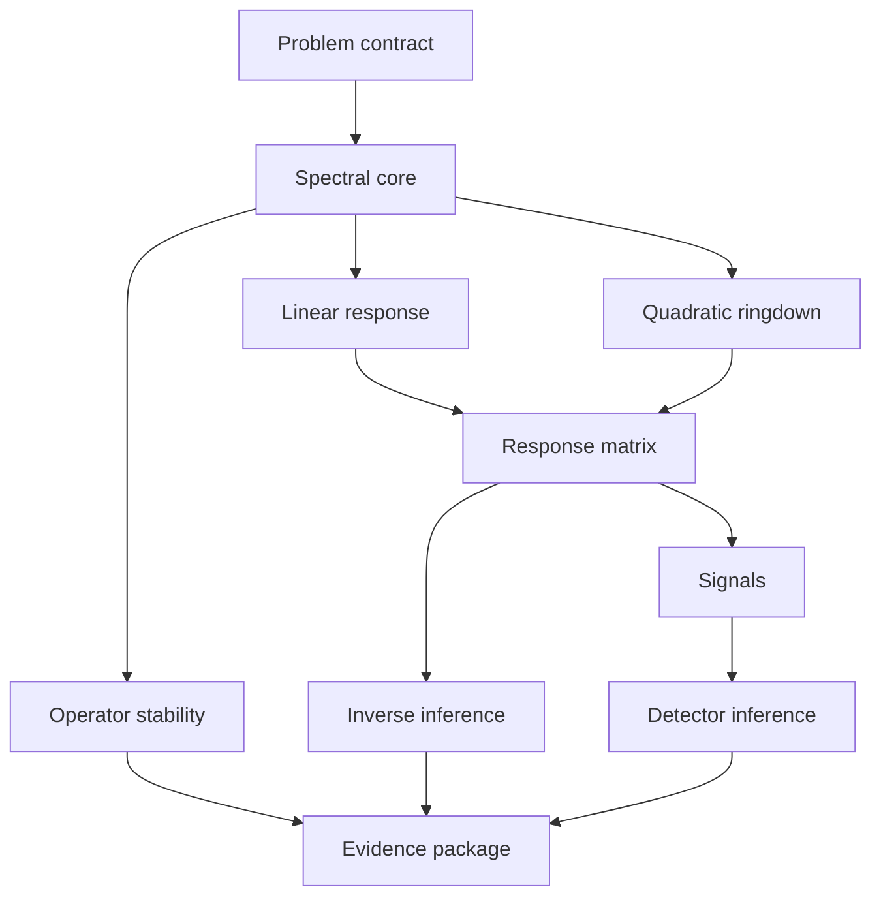

# Public Solver Capability DAG Design

**Status:** Approved for implementation on 2026-08-06.

## Goal

Build one public, native-Windows Kerr ringdown solver whose users request a scientific result instead of selecting a historical implementation sequence.

The public identity is:

> A theory-grounded nonlinear Kerr ringdown solver that computes evidence-graded linear and quadratic multimode responses, tracks deep and near-extremal mode branches, distinguishes physical perturbation mechanisms through inverse inference, and propagates them into waveforms and detector constraints.

Evidence labels apply only to the artifact and checks that support them; they
are never package-wide endorsements.

## Product boundary

The repository exposes one package, one study schema, one command family, and one artifact model. Historical repository names, implementation sequences, and migration labels are not public concepts. A numerical implementation enters the repository only after it satisfies a public provider contract and its validation fixtures.

Pole shifts, quadratic amplitudes, and observable waveforms remain distinct physical quantities. Mechanism conventions are also distinct: two perturbations with different boundary laws, gauges, normalizations, or source definitions cannot share a provider identity or be silently combined.

## Capability graph

The graph is the transitive reduction validated independently with Wolfram Language. It is acyclic.



Immediately after the spectral core, linear response, operator stability, and quadratic ringdown are independent and may execute concurrently. The planner computes the dependency closure for the requested target and nothing else.

## Public contracts

### Mode identity

`ModeKey` contains:

- spin weight `s`;
- angular indices `ell` and `m`;
- overtone `n`;
- branch;
- polarization.

Validation requires `ell ≥ |s|`, `|m| ≤ ell`, and `n ≥ 0`.

### Study request

A study file contains:

- `schema_version`;
- requested `target` capability;
- theory/mechanism identity and convention identity;
- mode keys and dimensionless spins;
- evidence profile;
- numerical policy.

Unknown fields fail closed. Spins must satisfy `−1 < a_over_m < 1`. A study request is canonicalized before hashing.

### Provider contract

Each admitted capability has exactly one active production provider, and an
unadmitted capability has none. A provider declares:

- capability;
- stable provider ID and implementation version;
- equation, convention, runtime, and numerical-policy fingerprints;
- upstream artifact types;
- output artifact type;
- availability and evidence level.

The current release contains built-in providers for validating and
materializing the problem contract and for exact selection from PR #2's
computed pure-Kerr lattice. It admits 2,736 roots: 690 for ℓ=2, 966 for ℓ=3,
and 1,080 for ℓ=4. All allowed m and n∈{0,1,2} are present across the approved
46/46/40 spin grids. Remaining scientific capabilities are explicitly
unavailable until their implementations and evidence are migrated. PR #3 will
migrate `linear-response` as a distinct capability. The engine never
substitutes synthetic science or reports an unavailable provider as completed.

Provider descriptors are snapshotted before execution. A successful engine run
must pass complete research-integrity verification before its run record is
persisted as successful.

### Artifact identity

Every artifact is a canonical JSON envelope. Its SHA-256 identity covers:

- schema and artifact type;
- capability and provider fingerprint;
- equation and convention identities;
- canonical study inputs and numerical policy;
- ordered upstream artifact identities;
- payload.

Persisted artifact, cache, and run JSON is byte-canonical. Duplicate keys and
non-finite numbers fail verification before hashing. User study JSON may use
ordinary whitespace but must not contain duplicate keys.

Changing only a downstream policy reuses unaffected upstream artifacts. Top-level numerical-policy keys named for capabilities are local namespaces; other keys are global. Each artifact hashes a request whose target is normalized to that capability and whose policy excludes other capability namespaces. The sealed run retains the full user request. A byte-identical warm request performs zero provider work. A cache binding is valid only when its key recomputes exactly from the loaded artifact's capability, provider, scoped request, and ordered upstream identities.

Provider, request, and payload mappings are deep immutable snapshots. A
downstream provider cannot mutate an upstream artifact after its identity is
computed.

Run records carry a canonical metadata digest. Verification does not trust the
record's artifact list: it reconstructs the requested plan and checks the full
closure, request identity, direct lineage, provider types, execution accounting,
evidence ceiling, and target evidence. The publication profile additionally
requires a complete evidence-package run with evaluated numerical and
scientific states; an intact unresolved or contradicted result remains valid.

### Evidence state

Every result records independent state dimensions:

- carrier: valid, invalid, or not applicable;
- execution: not run, running, succeeded, or failed;
- numerical evidence: not evaluated, converged, accepted, rejected, or unresolved;
- scientific claim: not evaluated, supported, conditionally supported, fragile, unresolved, or contradicted.

An unresolved or contradicted scientific claim is a valid output when the run and evidence records are intact. No downstream claim may exceed the weakest upstream evidence.

## Command surface

The command family is:

```text
solver plan study.json
solver run study.json [--store PATH]
solver verify RUN_ID [--store PATH] [--profile publication]
solver inspect RUN_ID [--store PATH]
solver export RUN_ID --output PATH [--store PATH]
```

`solver.ps1` is the native PowerShell entry point and delegates to the package-local Python module. Commands emit deterministic JSON. Validation and provider failures return nonzero and retain structured failure evidence when a run directory exists.

## Control-plane implementation boundary

The first merged change built the public control plane:

- typed contracts and strict JSON parsing;
- capability DAG and dependency-closure planner;
- one-provider-per-capability registry;
- content-addressed artifact and run store;
- resumable execution engine;
- fail-closed evidence aggregation;
- complete CLI and PowerShell launcher;
- example study, tests, and CI.

The spectral provider has since migrated as an exact selector over the 2,736
computed pure-Kerr roots: 690 for ℓ=2, 966 for ℓ=3, and 1,080 for ℓ=4.
Each row is a canonical determinant polish with full-grid numerical evidence;
392 Motohashi overlaps are independent comparisons rather than data sources.
The scientific conclusion remains `NOT_EVALUATED`. Response, nonlinear,
stability, waveform, detector, and inference providers have not migrated; their
absence is machine-readable and blocks the relevant target. PR #3 is the
`linear-response` provider migration only.

## Acceptance criteria

- The public package contains no historical version, sequence, or upgrade labels.
- Planning `evidence-package` returns the complete dependency closure in deterministic topological order.
- Planning `quadratic-ringdown` excludes unrelated stability, inverse, signal, and detector capabilities.
- A problem-contract run creates a hash-verified artifact and a completed run record.
- Repeating the identical run reuses the artifact and records zero provider executions.
- Requesting an unavailable scientific target fails closed with the exact unavailable capability.
- Artifact verification detects content tampering.
- Stored JSON rejects duplicate keys and any non-canonical byte representation.
- Cache verification rejects a hash-valid artifact bound to another computation.
- A detector-only policy change reuses every unaffected upstream artifact.
- A provider cannot mutate an upstream artifact snapshot in memory.
- Run verification rejects modified metadata and a re-sealed incomplete closure.
- Downstream artifacts cannot overstate rejected, unresolved, or contradicted inputs.
- Provider failures persist structured run evidence.
- Provider contract mutation during execution cannot alter artifact identity.
- Publication verification requires a complete evaluated evidence package.
- Export contains the run record and every reachable artifact.
- Windows and Python entry points exercise the same command implementation.
- Windows PowerShell 5.1 exercises the launcher in CI.
- Excessively large or deeply nested studies fail with structured input errors.
- The full test suite and package compile check pass on Python 3.12.
